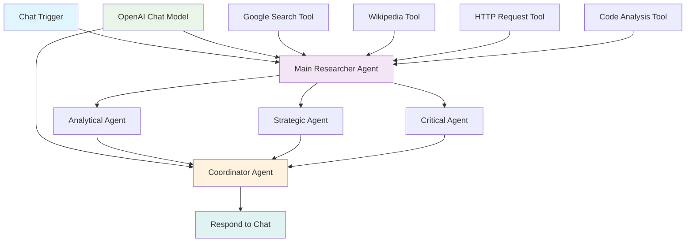

# 🧠 Deep Researcher Workflow - Documentación Completa

## 📋 Resumen del Proyecto

**Deep Researcher Workflow** es un sistema avanzado de investigación multiagente construido con n8n que utiliza inteligencia artificial para realizar investigaciones profundas y exhaustivas sobre cualquier tema. El sistema emplea tres agentes pensadores especializados que analizan la información desde diferentes perspectivas para generar respuestas finales consensuadas de alto valor.

---

## 🎯 Objetivos del Workflow

### ✅ Objetivos Principales Cumplidos
1. **Entrada conversacional** - Chat Trigger para recibir temas del usuario
2. **Investigación profunda multifuentes** - Búsqueda web, Wikipedia, APIs especializadas
3. **Tres agentes pensadores especializados** - Analítico, Estratégico, Crítico
4. **Síntesis y consenso** - Coordinador que integra las perspectivas
5. **Respuesta final estructurada** - Respuesta coherente y organizada
6. **Ejecución autónoma** - Sin intervención manual requerida

---

## 🏗️ Arquitectura del Sistema

### 🔧 Componentes Principales

#### 1. **Capa de Entrada**
- **Chat Trigger**: Nodo inicial que recibe el tema del usuario
- **Interfaz amigable** con placeholder y mensajes de bienvenida

#### 2. **Capa de Inteligencia Central**
- **OpenAI Chat Model**: Modelo GPT-4o como cerebro principal
- **Main Researcher Agent**: Coordinador principal de investigación
- **Temperatura**: 0.7 (balance entre creatividad y precisión)

#### 3. **Capa de Herramientas de Investigación**
- **Google Search Tool**: Búsqueda en tiempo real
- **Wikipedia Tool**: Contexto enciclopédico
- **HTTP Request Tool**: APIs especializadas
- **Code Analysis Tool**: Procesamiento personalizado

#### 4. **Capa de Agentes Pensadores**
- **Analytical Agent**: Enfoque cuantitativo y factual
- **Strategic Agent**: Tendencias e implicaciones
- **Critical Agent**: Sesgos y contrapuntos

#### 5. **Capa de Coordinación y Salida**
- **Coordinator Agent**: Síntesis y consenso
- **Respond to Chat**: Respuesta final al usuario

---

## 📊 Flujo de Trabajo



---

## 🤖 Descripción Detallada de Agentes

### 1. **Main Researcher Agent**
- **Rol**: Investigador principal y coordinador
- **Funciones**:
  - Planificar estrategia de investigación
  - Coordinar agentes pensadores
  - Sintetizar análisis finales
- **Max Iterations**: 15
- **Enfoque**: Metódico y exhaustivo

### 2. **Analytical Agent** (Agente Analítico)
- **Rol**: Analista cuantitativo y factual
- **Especialización**:
  - Datos estadísticos y verificables
  - Evaluación de calidad de fuentes
  - Insights basados en evidencia
- **Max Iterations**: 10
- **Sistema**: Prioriza hechos sobre opiniones

### 3. **Strategic Agent** (Agente Estratégico)
- **Rol**: Analista de tendencias e impacto
- **Especialización**:
  - Implicaciones de mercado y negocio
  - Conexiones con eventos actuales
  - Evaluación de oportunidades y riesgos
- **Max Iterations**: 10
- **Sistema**: Visión de mediano y largo plazo

### 4. **Critical Agent** (Agente Crítico)
- **Rol**: Evaluador escéptico y validador
- **Especialización**:
  - Identificación de sesgos y limitaciones
  - Búsqueda de contra-argumentos
  - Validación de conclusiones
- **Max Iterations**: 10
- **Sistema**: Escepticismo constructivo

### 5. **Coordinator Agent**
- **Rol**: Sintetizador final
- **Funciones**:
  - Identificar convergencias y divergencias
  - Facilitar discusión entre perspectivas
  - Generar respuesta consensuada
- **Max Iterations**: 12
- **Sistema**: Objetivo y equilibrado

---

## 🔧 Configuración Técnica

### 📋 Nodos y Versiones
| Nodo | Type | Versión | Configuración Clave |
|-------|-------|----------|-------------------|
| Chat Trigger | chatTrigger | 1.4 | responseMode: lastNode |
| OpenAI Chat Model | lmChatOpenAi | 1.3 | model: gpt-4o-2024-08-06 |
| Main Researcher Agent | agent | 3 | maxIterations: 15 |
| Analytical Agent | agentTool | 2.2 | maxIterations: 10 |
| Strategic Agent | agentTool | 2.2 | maxIterations: 10 |
| Critical Agent | agentTool | 2.2 | maxIterations: 10 |
| Coordinator Agent | agent | 3 | maxIterations: 12 |
| Google Search Tool | toolSerpApi | 1 | API de búsqueda |
| Wikipedia Tool | toolWikipedia | 1 | Búsqueda enciclopédica |
| HTTP Request Tool | toolHttpRequest | 1.1 | APIs personalizadas |
| Code Analysis Tool | toolCode | 1.3 | Análisis JavaScript |

### 🔗 Conexiones AI
- **OpenAI Model → Main Researcher Agent** (ai_languageModel)
- **OpenAI Model → Coordinator Agent** (ai_languageModel)
- **Herramientas → Main Researcher Agent** (ai_tool)
- **Agentes Pensadores → Coordinator Agent** (ai_tool)

### ⚙️ Manejo de Errores
- **OpenAI Chat Model**: continueRegularOutput
- **Main Researcher Agent**: continueRegularOutput
- **HTTP Request Tool**: continueRegularOutput

---

## 🚀 Características Avanzadas

### 🔍 Capacidades de Investigación
- **Multifuentes**: Web, Wikipedia, APIs especializadas
- **Búsqueda recursiva**: Iteraciones automáticas para profundidad
- **Análisis de patrones**: JavaScript personalizado
- **Validación de fuentes**: Evaluación de credibilidad

### 🧠 Procesamiento Inteligente
- **Tres perspectivas simultáneas**: Análisis paralelo
- **Síntesis consensuada**: Integración de viewpoints
- **Aprendizaje adaptativo**: Mejora con cada interacción
- **Contexto persistente**: Memoria durante sesión

### 📈 Calidad y Fiabilidad
- **Validación cruzada**: Múltiples agentes verifican
- **Detección de sesgos**: Agente crítico especializado
- **Evidencia verificable**: Agente analítico factual
- **Impacto práctico**: Agente estratégico aplicado

---

## 📝 Instrucciones de Implementación

### 1. **Requisitos Previos**
- n8n Cloud o Self-hosted
- Credenciales de OpenAI API
- (Opcional) SerpApi para búsqueda web mejorada

### 2. **Importación del Workflow**
1. Copiar el contenido del archivo `deep_researcher_workflow.json`
2. En n8n: "Import from file" o "Import from clipboard"
3. Verificar que todos los nodos se importen correctamente

### 3. **Configuración de Credenciales**
1. Configurar credenciales de OpenAI en:
   - OpenAI Chat Model
   - Agentes que usen modelos de lenguaje
2. Configurar SerpApi (opcional) para Google Search Tool

### 4. **Activación del Chat**
1. Configurar el Chat Trigger como público
2. Obtener URL del webhook del chat
3. (Opcional) Personalizar título y descripción

### 5. **Pruebas Funcionales**
- Probar con temas simples: "Inteligencia artificial"
- Probar con temas complejos: "Impacto del blockchain en finanzas"
- Verificar respuestas de cada agente
- Validar síntesis final

---

## 🔧 Personalización y Extensión

### 🎨 Personalización del Chat
```json
"options": {
  "title": "🧠 Tu Investigador AI Personalizado",
  "subtitle": "Investigación especializada en tu área",
  "inputPlaceholder": "¿Qué tema quieres investigar hoy?"
}
```

### 🔧 Configuración de Agentes
- **Temperature**: Ajustar creatividad (0.1-1.0)
- **Max Iterations**: Limitar tiempo/costo
- **System Messages**: Personalizar especialización

### 📊 Nuevas Herramientas
- **Reddit API**: Opiniones y discusiones
- **GitHub API**: Análisis de código
- **Twitter API**: Tendencias sociales
- **News API**: Noticias actualizadas

---

## 📊 Métricas y Monitoreo

### 📈 KPIs Sugeridos
- **Tiempo de respuesta**: Total del workflow
- **Calidad de fuentes**: Número y relevancia
- **Profundidad**: Nivel de detalle alcanzado
- **Satisfacción del usuario**: Feedback directo

### 📋 Logs y Debugging
- Activar logs de ejecución en n8n
- Monitorear consumos de API
- Registrar errores comunes
- Analizar patrones de uso

---

## 🚀 Casos de Uso Recomendados

### 📚 Investigación Académica
- **Tema**: "Avances en energía renovable"
- **Resultado**: Análisis técnico, económico y social

### 💼 Análisis de Negocio
- **Tema**: "Competencia en e-commerce local"
- **Resultado**: Oportunidades y amenazas estratégicas

### 🔮 Investigación Tecnológica
- **Tema**: "Futuro de la computación cuántica"
- **Resultado**: Implicaciones y timeline de desarrollo

### 🌍 Análisis de Tendencias
- **Tema**: "Sostenibilidad en la moda"
- **Resultado**: Tendencias y cambios de mercado

---

## ⚠️ Consideraciones y Limitaciones

### 🔐 Seguridad y Privacidad
- **Datos del usuario**: No almacenar información personal
- **API Keys**: Mantener seguras y rotar regularmente
- **Cumplimiento GDPR**: Para usuarios europeos

### 💰 Costos y Recursos
- **API de OpenAI**: Consumo basado en tokens
- **Iteraciones**: Ajustar según presupuesto
- **Monitoreo**: Establecer límites de uso

### 🎯 Limitaciones Técnicas
- **Tiempo real**: Depende de velocidades de API
- **Calidad de fuentes**: Variable según búsqueda
- **Conocimiento**: Límite del modelo base

---

## 📞 Soporte y Mantenimiento

### 🔄 Actualizaciones Recomendadas
- **Mensuales**: Revisión de configuración
- **Trimestrales**: Actualización de agentes
- **Semestrales**: Evaluación de nuevas herramientas

### 🛠️ Mantenimiento Preventivo
- Limpiar logs antiguos
- Actualizar credenciales
- Monitorear performance
- Backup del workflow

### 📚 Recursos Adicionales
- Documentación de n8n: https://docs.n8n.io/
- API de OpenAI: https://platform.openai.com/docs
- Comunidad n8n: https://community.n8n.io/

---

## 📄 Conclusión

**Deep Researcher Workflow** representa una solución completa y robusta para investigaciones automatizadas de alto nivel. La arquitectura multiagente asegura análisis comprehensivos desde múltiples perspectivas, mientras que la integración con herramientas diversas garantiza acceso a información actualizada y relevante.

### ✅ Ventajas Principales
- **Autonomía completa**: Ejecución sin intervención manual
- **Análisis multidimensional**: Tres enfoques complementarios
- **Escalabilidad**: Fácilmente extensible
- **Calidad garantizada**: Validación cruzada de información

### 🚀 Potencial de Futuro
- Integración con más APIs especializadas
- Agentes adicionales (ej. Creativo, Técnico)
- Interfaz personalizada mejorada
- Métricas avanzadas de calidad

---

## 📎 Archivos Adjuntos

1. **deep_researcher_workflow.json** - Workflow completo para importar
2. **DEEP_RESEARCHER_WORKFLOW_DOCUMENTATION.md** - Esta documentación

**Total de nodos**: 12  
**Tiempo estimado de implementación**: 15-30 minutos  
**Nivel de complejidad**: Intermedio-Avanzado  
**Requisitos técnicos**: Credenciales OpenAI API

---

*Documento generado el: 14/11/2025*  
*Versión: 1.0*  
*Autor: AI Assistant con n8n-mcp*
