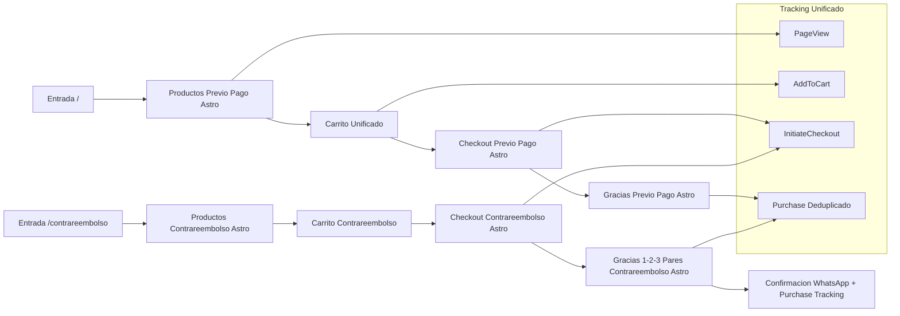

# REPORTE FINAL MIGRACION ASTRO CORREGIDA

Este documento unifica el análisis del embudo legacy de rositarococo.com y su migración a Astro (carpeta `rosita2/`) en un plan maestro único, accionable y testeable hasta 100%. No incluye código nuevo, solo especificaciones para que modos de implementación y debug puedan ejecutar.

Se integra la información de:
- index.html (flujo previo pago / oferta 2 pares)
- contrarreembolso*.html y contrarreembolsonueva.html (flujos contrarreembolso)
- Páginas de gracias (gracias-1par-c.html y variantes)
- Reportes y TODOs:
  - TODO_CONTRA_REEMBOLSO.md
  - TODO_CAMBIO_PRECIO.md
  - REPORTE_TESTING_CONTRA_REEMBOLSO_FINAL.md
  - REPORTE_TESTING_REAL_CONTRA_REEMBOLSO.md
  - REPORTE_OPTIMIZACION_CONTRA_REEMBOLSO_PERFORMANCE.md
  - REPORTE_DEBUGGING_CRITICO_CONTRA_REEMBOLSO.md
  - REPORTE_CORRECCION_REDIRECTION_CONTRA_REEMBOLSO.md
  - REPORTE_CORRECCION_CRITICA_WHATSAPP_CONTRA_REEMBOLSO.md
  - Otros reportes de solución y diagnóstico relacionados
- Proyecto Astro:
  - rosita2/astro.config.mjs
  - rosita2/src/pages/index.astro
  - rosita2/src/pages/contrareembolso.astro
  - rosita2/src/components/*.astro
  - rosita2/dist/* (salida build actual)

La implementación debe seguir este reporte como única fuente maestra de verdad.

---

## 1) RESUMEN EJECUTIVO

### 1.1 Flujos de embudo considerados

- Flujo Previo Pago (Legacy)
  - Entrada principal: index.html
  - Carrito + selección de productos guillerminas
  - Formulario Google Forms (previo pago / promociones históricas)
  - Redirecciones a páginas con instrucción de pago (2gracias-1par.html, 3/4/5gracias-1par.html y variantes históricas con MercadoPago / transferencia)
  - Integraciones: Facebook Pixel, GTM (en versiones viejas), WhatsApp, notificaciones visuales.

- Flujo Contrarreembolso (Legacy)
  - Entradas múltiples históricas: contrareembolso.html, contrareembolso-original.html, contrareembolso-moderno.html, contrareembolso-2.html, contrareembolsonueva.html, etc.
  - Versión consolidada: contrareembolsonueva.html (última base estable + fixes)
    - Carrito flotante
    - Promos específicas (Milán, Trento, Parma, etc.)
    - Validación crítica de WhatsApp
    - Envío a Google Script / n8n
    - Redirecciones gracias-1par-c.html, gracias-2pares-c.html, gracias-3pares.html
    - Webhooks para tracking dual (fbq + servidor)

- Flujos de Gracias y Confirmación
  - gracias-1par-c.html: confirmación contrarreembolso + CTA WhatsApp obligatorio.
  - 2gracias-1par.html, 3gracias-1par.html, 4gracias-1par.html, 5gracias-1par.html: variantes legacy orientadas a previo pago / MercadoPago / transferencia.
  - Variantes con lógicas parciales o desactualizadas.

- Proyecto Astro (Nuevo Embudo)
  - rosita2/ (proyecto Astro independiente dentro del repo)
  - index.astro: nueva home / embudo basado en oferta guillerminas + carrito moderno + checkout integrado.
  - contrareembolso.astro: página de contrarreembolso moderna.
  - Componentes: Header.astro, ProductGrid.astro, Testimonials.astro, CheckoutForm.astro, Layout.astro.
  - dist/index.html, dist/contrareembolso/index.html, dist/gracias-1par-c/index.html, dist/gracias-2pares-c/index.html: salida del build actual.

### 1.2 Estado actual de la migración

A alto nivel:

- Proyecto Astro existe y está parcialmente implementado:
  - index.astro y contrareembolso.astro reutilizan Layout y componentes.
  - Hay carrito, secciones visuales, testimonios y formulario de checkout en componentes.
  - Se observan textos y overlays heredados que aún hacen referencia a redirecciones a MercadoPago.
  - dist/ contiene versiones generadas, incluyendo páginas de gracias en Astro.

- Flujos legacy han sido intensamente debuggeados:
  - contrareembolsonueva.html cuenta con:
    - Validación WhatsApp corregida (ID correcto 501094818).
    - Webhooks consistentes.
    - Redirecciones de gracias corregidas (URLs relativas).
    - Limpieza de logs y mejoras de performance.
    - Mensajería coherente con contrarreembolso.
  - Reportes indican que los principales bugs críticos del flujo contrarreembolso legacy están resueltos.

- Gaps detectados (a completar en Astro):
  - No hay confirmación explícita, en este repo, de:
    - Paridad 1:1 entre lógica de carrito legacy y carrito en Astro (precios, máximos, combos).
    - Paridad 1:1 entre lógica de validación WhatsApp contrarreembolso legacy y Astro.
    - Paridad completa de tracking dual (Meta Pixel + servidor) en todas las rutas Astro.
    - Paridad 1:1 de páginas de gracias contrarreembolso en Astro conectadas al embudo nuevo.
  - Persisten diferencias de copy, mensajes y flujos (ej: mensajes de MercadoPago en algunas salidas Astro).

### 1.3 Conclusión ejecutiva

- La migración a Astro está avanzada a nivel estructura (proyecto rosita2, rutas clave, componentes base).
- El flujo contrarreembolso legacy fue saneado y debe ser la referencia exacta para replicar en Astro.
- El objetivo inmediato: alinear 100%:
  - rutas,
  - carrito,
  - checkout,
  - WhatsApp,
  - páginas de gracias,
  - tracking y webhooks,
entre legacy consolidado y Astro, dejando legacy solo como fallback histórico.

El resto del documento define:
- Arquitectura actual vs objetivo.
- Mapas de embudos legacy vs Astro.
- Matriz origen -> Astro.
- Checklist detallado de funcionalidades.
- Plan de migración por fases.
- Estrategia de testing con MCP Chrome DevTools.
- Riesgos, dependencias y prioridades.

---

## 2) ARQUITECTURA ACTUAL VS ARQUITECTURA ASTRO

### 2.1 Arquitectura Legacy (Simplificada)

- Nivel Archivo:
  - index.html:
    - Hero y product grid muy cargado.
    - Promos 2 pares, carritos, Swiper, scripts inline y externos.
    - Formulario Google Forms (embudo previo pago / formularios históricos).
    - Integraciones:
      - Facebook Pixel con lógica PageView e InitiateCheckout.
      - Webhooks N8N para eventos y tracking dual.
      - WhatsApp widgets y validaciones.
  - contrareembolsonueva.html:
    - Página dedicada a contrarreembolso.
    - Sistema de carrito optimizado.
    - Validación WhatsApp con webhook.
    - Envío a Google Script / n8n.
    - Redirecciones a gracias-1par-c.html, gracias-2pares-c.html, gracias-3pares.html.
    - Eventos fbq + dual tracking.
    - Múltiples fixes ya documentados en reportes.
  - Páginas de gracias:
    - gracias-1par-c.html:
      - Confirmación contrarreembolso.
      - CTA obligatorio de confirmación por WhatsApp.
      - Lógica para leer detalles (localStorage o query) y armar mensaje.
      - Evento Purchase contrarreembolso (con lógica avanzada de deduplicación y FBC/FBP).
    - 2gracias-1par.html, 3gracias-1par.html, 4gracias-1par.html, 5gracias-1par.html:
      - Templates legacy mezclados (MercadoPago / transferencia) menos consistentes.
  - Recursos JS/CSS dispersos:
    - otono-elegante2.js, fix-contrareembolso-cart.js, chat-widget*.js, etc.
    - Estilos de hero, badges, carruseles, notificaciones, etc.

- Características:
  - Alta complejidad inline.
  - Lógica de negocio y tracking mezclada con markup.
  - Variantes históricas sin consolidación.
  - Mejoras recientes centradas en contrareembolsonueva.html.

### 2.2 Arquitectura Astro Actual (rosita2/)

- Estructura:
  - rosita2/astro.config.mjs:
    - Integraciones: @astrojs/tailwind, @astrojs/sitemap.
    - Configuración base para build estático.
  - rosita2/src/layouts/Layout.astro:
    - Layout base compartido (head, estilos globales, etc.).
  - rosita2/src/components/:
    - Header.astro:
      - Top bar beneficios, branding, hero.
    - ProductGrid.astro:
      - Render grid de productos.
      - Props: lista de productos, promo, modo contrarreembolso o no.
      - Debe encapsular carritos, precios y botones agregar.
    - Testimonials.astro:
      - Basado en sección de testimonios index.html.
    - CheckoutForm.astro:
      - Formulario de checkout basado en index.html:
        - Campos de envío.
        - Validaciones.
        - Integración con endpoint externo (esperado).
  - rosita2/src/pages/:
    - index.astro:
      - Página principal migrada: productos + checkout + testimonios.
    - contrareembolso.astro:
      - Página dedicada a contrarreembolso.
      - Usa ProductGrid, CheckoutForm, etc.
    - (Pendientes/implícitas) gracias-1par-c.astro, gracias-2pares-c.astro según planning.
  - rosita2/dist/:
    - index.html: salida build de index.astro.
    - contrareembolso/index.html: salida build de contrareembolso.astro.
    - gracias-1par-c/index.html, gracias-2pares-c/index.html: salidas para flujos de gracias.
    - CSS y JS optimizados.

- Características:
  - Arquitectura modular:
    - Layout + componentes reutilizables.
  - Preparado para:
    - Carrito unificado.
    - Checkout integrado.
    - Integraciones encapsuladas (tracking, WhatsApp).
  - Todavía requiere:
    - Alineación completa con lógica de negocio real (precios, promociones, límites).
    - Alineación con fixes recientes de contrareembolso legacy y sus reportes.
    - Limpieza de mensajes obsoletos (ej: referencias a MercadoPago donde no corresponda).
    - Verificación 1:1 de tracking y páginas de gracias.

### 2.3 Arquitectura Objetivo (Alta Nivel)

- Dominio público (usuario):
  - / (root):
    - Servido por Astro index.astro (no por index.html legacy).
  - /contrareembolso:
    - Servido por Astro contrareembolso.astro.
  - /gracias-1par-c, /gracias-2pares-c, /gracias-3pares:
    - Servidos por páginas Astro (o rutas estáticas generadas por Astro) coherentes con flujo contrarreembolso y previo pago.

- Capas:
  - Presentación:
    - Layout.astro + Header.astro + ProductGrid.astro + Testimonials.astro.
  - Lógica de negocio:
    - Carrito centralizado (JS o integración Astro) utilizado por index.astro y contrareembolso.astro.
    - Lógica de precios dependiente de contexto (previo pago vs contrarreembolso).
  - Checkout:
    - CheckoutForm.astro:
      - Maneja:
        - Formulario de envío.
        - Validación WhatsApp.
        - Construcción de datos del pedido.
        - Envío a endpoint externo (n8n / Google Script) configurable.
        - Redirección a páginas de gracias Astro.
  - Tracking:
    - Módulo central de tracking inyectado desde Layout.astro:
      - fbq init con ID 1052677351596434.
      - sendDualEvent(eventName, eventData) inspirado en lógica consolidada legacy.
      - Eventos adecuados:
        - PageView, ViewContent, AddToCart, InitiateCheckout, Purchase.
      - Cumplimiento deduplicación y FBC/FBP según versiones funcionales de gracias-1par-c.html.

---

## 3) MAPA DEL EMBUDO Y MATRIZ DE CORRESPONDENCIA

### 3.1 Mapa Embudo Original Previo Pago (Legacy)

Secuencia típica:

1) Entrada:
   - index.html

2) Descubrimiento:
   - Hero, beneficios, carruseles, grid modelos.

3) Selección:
   - Combos y talles.
   - JS actualiza campos ocultos (ej: 286442883).
   - Mensajes de carrito y notificaciones.

4) Checkout:
   - Formulario Google Forms embebido.
   - Envío a Google Script / integraciones.
   - Tracking:
     - fbq PageView, AddToCart, InitiateCheckout.

5) Post-Checkout:
   - Redirección a páginas estilo 2gracias-1par.html / similares:
     - Instrucciones de pago (MercadoPago / transferencia).
     - Links a WhatsApp para confirmar.

### 3.2 Mapa Embudo Original Contrarreembolso (Legacy Consolidado)

Secuencia consolidada (basada en contrareembolsonueva.html y reportes):

1) Entrada:
   - contrareembolsonueva.html (debe considerarse fuente de verdad Legacy).

2) Descubrimiento:
   - Hero y explicación contrarreembolso (paga al recibir, envío gratis).
   - Product grid limitado (Milán, Trento, Parma u otros modelos específicos).
   - Mensajes de urgencia y badges.

3) Selección:
   - Carrito flotante.
   - Máximo permitido (ej: 2 pares).
   - Talles y modelos guardados en campo oculto.
   - Feedback visual cuando se agrega al carrito.

4) Checkout:
   - Formulario con datos personales, dirección, provincia, CP, franja horaria.
   - Validación WhatsApp (501094818) con webhook:
     - Bloquea flujo si no es válido.
   - Tracking:
     - AddToCart.
     - InitiateCheckout con contenido detallado.
   - Envío:
     - Google Script / n8n.
     - Redirecciones corregidas (URLs relativas).

5) Post-Checkout:
   - Redirección según cantidad:
     - 1 par: gracias-1par-c.html
     - 2 pares: gracias-2pares-c.html
     - 3+ pares: gracias-3pares.html
   - Páginas de gracias:
     - Render de pedido.
     - CTA WhatsApp obligatorio para confirmar.
     - Evento Purchase y dual tracking avanzado (en gracias-1par-c.html modernizada).

### 3.3 Mapa Objetivo en Astro

Objetivo: replicar ambos embudos bajo rosita2, con consistencia y sin duplicar lógica caóticamente.

Propuesta de rutas principales Astro:

- / (index.astro):
  - Flujo previo pago modernizado:
    - ProductGrid.astro con todos los productos relevantes actualizados.
    - Carrito unificado (modo previo pago).
    - CheckoutForm.astro integrado:
      - Config para pagos anticipados (MercadoPago / transferencia / otros).
      - Tracking InitiateCheckout previo pago.
    - Redirecciones a páginas de gracias Astro específicas (por ejemplo /gracias/..., ya reflejadas en dist).

- /contrareembolso (contrareembolso.astro):
  - Flujo contrarreembolso completo:
    - ProductGrid.astro en modo contrarreembolso:
      - Solo productos contrarreembolso (Milán, Trento, Parma, etc.) con precios correctos.
    - Carrito con reglas específicas:
      - Límite de pares.
      - Cálculo de montos contrarreembolso.
    - CheckoutForm.astro en modo contrarreembolso:
      - Validación WhatsApp replicando lógica legacy consolidada.
      - Envío a endpoint contrarreembolso.
      - Redirección a gracias-1par-c.astro, gracias-2pares-c.astro, gracias-3pares.astro.

- /gracias-1par-c, /gracias-2pares-c, /gracias-3pares:
  - Páginas Astro:
    - Recuperan info del pedido (query params y/o localStorage).
    - Construyen mensaje WhatsApp idéntico al legacy corregido.
    - Disparan Purchase con deduplicación y FBC/FBP.
    - Muestran instrucciones claras de confirmación.

### 3.4 Matriz de Correspondencia (Origen -> Astro)

Esta matriz guía la implementación; no implica que todo exista hoy, sino cómo debe alinearse.

- index.html (previo pago legacy)
  - -> rosita2/src/pages/index.astro
    - Estructura hero, grid, testimonios, checkout.
    - Integración carrito.
    - Tracking: PageView, AddToCart, InitiateCheckout previo pago.
    - Estados de error y validaciones integrados en CheckoutForm.astro.

- contrareembolsonueva.html (legacy consolidado)
  - -> rosita2/src/pages/contrareembolso.astro
    - Mismas reglas de:
      - Productos contrarreembolso.
      - Límite de pares.
      - Validación WhatsApp con webhook.
      - Mensajes, overlays y loading coherentes.
      - Envío y redirecciones a gracias.
    - Debe heredar fixes de:
      - REPORTE_DEBUGGING_CRITICO_CONTRA_REEMBOLSO.md
      - REPORTE_CORRECCION_REDIRECTION_CONTRA_REEMBOLSO.md
      - REPORTE_CORRECCION_CRITICA_WHATSAPP_CONTRA_REEMBOLSO.md
      - REPORTE_OPTIMIZACION_CONTRA_REEMBOLSO_PERFORMANCE.md

- gracias-1par-c.html (contrarreembolso)
  - -> rosita2/src/pages/gracias-1par-c.astro (o equivalente):
    - CTA WhatsApp obligatorio con mensaje construido con datos del pedido.
    - Purchase con deduplicación.
    - Mantener beneficios corregidos.

- gracias-2pares-c.html, gracias-3pares.html
  - -> rosita2/src/pages/gracias-2pares-c.astro, rosita2/src/pages/gracias-3pares.astro
    - Mismo patrón que 1 par, variando contenido_ids, value, texto.

- 2gracias-1par.html, 3gracias-1par.html, 4gracias-1par.html, 5gracias-1par.html (legacy mixto)
  - -> Clasificar:
    - Como legacy obsoleto (solo referencia histórica).
    - Reemplazar por nuevas gracias Astro según flujo actual de negocio.
    - Documentar claramente en despliegue qué URLs seguirán activas o redirigidas.

- Scripts JS específicos legacy (otono-elegante2.js, fix-contrareembolso-cart.js, etc.)
  - -> Incorporar solo la lógica validada en:
    - ProductGrid.astro (carrito).
    - CheckoutForm.astro (checkout + validaciones).
    - Layout.astro (tracking y modales globales).
  - Evitar replicar ruido o funciones en desuso.

---

## 4) CHECKLIST DE FUNCIONALIDADES CRÍTICAS A REPLICAR EN ASTRO

Esta sección es la guía de implementación funcional. Cada ítem debe poder marcarse como completado y verificado.

### 4.1 UI / Estética

- [ ] Estructura visual:
  - Hero, top-benefits-bar, promo principal.
  - Grid de productos con imágenes, badges, precios, promociones.
  - Sección de testimonios tipo masonry optimizada.
- [ ] Consistencia:
  - Tipografías: Playfair Display + Lato (o equivalente) configuradas globalmente.
  - Paleta de colores y estilo Rosita Rococó.
- [ ] Responsive:
  - Mobile-first optimizado.
  - Contenido clave visible sin scroll excesivo ni solapamientos.
- [ ] Elementos visuales clave:
  - Badges de stock limitado, nueva temporada, etc.
  - Notificaciones de agregado al carrito y prueba social.

### 4.2 Carrito y Actualización de Precios

- [ ] Carrito unificado:
  - Lógica central (no duplicada) utilizada por:
    - index.astro (previo pago)
    - contrareembolso.astro (contrarreembolso)
- [ ] Reglas de negocio:
  - Previo pago:
    - Promos vigentes (ej: 2x $95.000), montos y combos actualizados.
  - Contrarreembolso:
    - Precios coherentes con últimas definiciones (ej: 1 par vs 2 pares).
    - Límite de pares según estrategia.
- [ ] Sincronización visual:
  - Mini-cart, botón flotante y contador siempre coherentes.
  - Mensajes contextualizados (sin referencias inconsistentes a otros métodos de pago).
- [ ] Persistencia:
  - Carrito persistido (localStorage) cuando sea necesario.
  - Limpieza y migración controlada entre pasos.

### 4.3 Flujo de Checkout + Validaciones

- [ ] CheckoutForm.astro:
  - Campos obligatorios equivalentes a legacy (nombre y apellido, WhatsApp, dirección completa, provincia, CP, franja horaria, etc.).
  - Mensajes de error claros, en línea, consistentes.
- [ ] Validaciones:
  - WhatsApp:
    - Lógica similar a validateWhatsAppInline del legacy:
      - Formato sin 0 ni 15 según copy.
      - Llamada a webhook cuando aplique (contrarreembolso).
      - Feedback visual verde/rojo.
  - Campos obligatorios:
    - No permitir envío con campos críticos vacíos o inválidos.
  - Prevención de loops:
    - Evitar estados "Procesando" infinitos.
- [ ] Envío:
  - Integración con endpoint externo (n8n / Google Scripts) definible:
    - Un solo punto de configuración por entorno.
  - Manejo de errores:
    - Mensajes claros en caso de fallo.
    - Reintentos o instrucciones.

### 4.4 Lógica Completa de Contrarreembolso

- [ ] Productos específicos:
  - contrareembolso.astro debe ofrecer solo los modelos y promos aprobados.
- [ ] Carrito contrarreembolso:
  - Lógica de cantidades y precios exacta al legacy consolidado.
  - Manejo de máximo de pares y mensajes explicativos.
- [ ] Validación WhatsApp crítica:
  - Replica de comportamiento y mensajes de contrareembolsonueva.html corregida.
- [ ] Envío y Redirecciones:
  - Redirigir a gracias-1par-c / gracias-2pares-c / gracias-3pares Astro según cantidad.
  - URLs relativas robustas, sin dominios hardcode.
- [ ] Confirmación por WhatsApp:
  - Páginas de gracias deben construir link y mensaje prellenado correctamente.

### 4.5 Estados de Error y Edge Cases

- [ ] Estados a cubrir:
  - Carrito vacío intentando ir al checkout.
  - WhatsApp inválido o no confirmable.
  - Endpoint externo no responde (timeout).
  - Reload en páginas de gracias sin datos (falta localStorage / query).
  - Acceso directo malicioso a páginas de gracias sin token válido.
- [ ] Comportamiento esperado:
  - Mensajes claros y no técnicos.
  - No romper el flujo ni mostrar errores JS en consola.
  - En casos críticos, instrucciones para reintentar o contactar.

### 4.6 Integraciones: Píxeles, Eventos, UTMs, WhatsApp, Chat

- [ ] Meta Pixel:
  - fbq('init', '1052677351596434') en Layout.astro una sola vez.
  - PageView en cada ruta relevante:
    - index.astro
    - contrareembolso.astro
    - gracias-*.astro
- [ ] Tracking dual (client + server):
  - Implementación centralizada tipo sendDualEvent(eventName, eventData).
  - Eventos clave:
    - PageView
    - ViewContent
    - AddToCart (en agregar al carrito)
    - InitiateCheckout (al iniciar envío formulario)
    - Purchase (en páginas de gracias, con deduplicación).
- [ ] UTMs:
  - Conservación de fbclid / utm_* en localStorage cuando llegue tráfico pago.
  - Reutilizar en eventos server-side.
- [ ] WhatsApp:
  - Widgets y CTAs integrados sin duplicar scripts legacy rotos.
  - Mensajes generados con datos reales del pedido.
- [ ] Chat / otros:
  - Cualquier chat-widget debe ser opcional y bien aislado.
  - Evitar interferir con embudo.

---

## 5) PLAN DE MIGRACION POR FASES

Este plan asume que los modos de implementación seguirán este orden. No implica cambios automáticos de DNS/hosting hasta completar testing.

### Fase 1: Mapeo y Replicación de Páginas Clave

Objetivo: asegurar cobertura 1:1 de rutas y estructuras.

- [ ] Revisar en detalle:
  - rosita2/src/pages/index.astro
  - rosita2/src/pages/contrareembolso.astro
  - rosita2/dist/index.html
  - rosita2/dist/contrareembolso/index.html
  - rosita2/dist/gracias-1par-c/index.html
  - rosita2/dist/gracias-2pares-c/index.html
- [ ] Confirmar que:
  - index.astro refleja estructura y contenido actual del embudo previo pago deseado (no histórica obsoleta).
  - contrareembolso.astro refleja estructura consolidada del flujo contrareembolso legacy.
- [ ] Crear o validar páginas Astro:
  - gracias-1par-c.astro
  - gracias-2pares-c.astro
  - gracias-3pares.astro
- [ ] Documentar en comentarios internos dónde se replica cada sección legacy.

### Fase 2: Migración de Funcionalidades Críticas

Objetivo: portar la lógica de negocio y validaciones desde legacy consolidado a Astro.

- [ ] Carrito unificado:
  - Definir fuente única de verdad para:
    - Añadir/quitar productos.
    - Reglas de precio según contexto.
- [ ] CheckoutForm.astro:
  - Incluir todas las validaciones necesarias.
  - Adaptar envío a endpoints reales (previo pago vs contrarreembolso).
- [ ] Contrarreembolso.astro:
  - Portar:
    - Validación WhatsApp con webhook.
    - Manejo de tokens y protección de gracias.
- [ ] Alinear mensajes, overlays y loaders con:
  - REPORTE_CORRECCION_REDIRECTION_CONTRA_REEMBOLSO.md
  - Evitar textos de MercadoPago donde ya no aplique.

### Fase 3: Integraciones Externas (Tracking, WhatsApp, Webhooks)

Objetivo: que el embudo Astro sea analíticamente equivalente o superior al legacy.

- [ ] Centralizar Meta Pixel en Layout.astro:
  - Con PageView por ruta.
- [ ] Implementar sendDualEvent central:
  - Siguiendo lineamientos de index.html y gracias-1par-c.html modernos.
- [ ] Purchase events:
  - Solo en páginas de gracias, con:
    - Token o flag de validación.
    - Deduplicación por fbclid / localStorage como en legacy.
- [ ] WhatsApp:
  - Integrar modales/botones:
    - Para guardar carrito.
    - Para confirmar pedido contrarreembolso.
- [ ] Webhooks:
  - Parametrizar endpoints para:
    - Validación WhatsApp.
    - Eventos server-side (n8n).
    - Dejarlo en config dedicadas, no hardcode en múltiples lugares.

### Fase 4: Pulido Visual y Performance

Objetivo: que Astro supere al legacy en UX y performance.

- [ ] Ajustar estilos:
  - Tailwind o CSS modular para:
    - Hero, grid, testimonios.
    - Cart, botones flotantes, formularios.
- [ ] Eliminar dependencias innecesarias:
  - jQuery si no es estrictamente requerido.
  - Scripts inline repetidos.
- [ ] Optimizar:
  - Imágenes: uso correcto de formatos .webp y tamaños.
  - Carga diferida de componentes no críticos.
- [ ] Verificar:
  - No hay console.log ruidosos en producción.
  - No hay requests innecesarios.

### Fase 5: Testing Integral y Validación Final

Objetivo: declarar la migración como 100% completada y confiable.

- [ ] Ejecutar batería de pruebas (ver sección 6).
- [ ] Resolver todos los issues detectados.
- [ ] Validar métricas:
  - Sin errores JS en consola.
  - Sin requests 404 en recursos críticos.
  - Eventos de tracking presentes y sin duplicaciones.

---

## 6) PLAN DE TESTING CON MCP CHROME DEV TOOLS

La validación debe hacerse comparando directamente legacy vs Astro usando la integración chrome-devtools MCP.

### 6.1 Principios Generales

- Siempre probar en paralelo:
  - Legacy (index.html / contrareembolsonueva.html)
  - Astro (rosita2/dist/index.html y rosita2/dist/contrareembolso/index.html, o entorno deploy Astro)
- Para cada flujo:
  - Verificar UI, lógica y tracking.
  - Usar screenshot, snapshot accesible y logs.

### 6.2 Casos de Prueba por Página / Flujo

A ejecutar con MCP Chrome DevTools (lista resumida, sin código):

1) Flujo Previo Pago (Astro vs Legacy)
- Escenario A: 1 par
  - Agregar 1 producto.
  - Ver mini-cart, contador y total correctos.
  - Iniciar checkout.
  - Validar errores si faltan campos.
  - Enviar formulario:
    - Confirmar redirección a página de gracias correspondiente.
    - Verificar evento InitiateCheckout.
- Escenario B: 2 pares (promo)
  - Agregar 2 productos.
  - Confirmar precio promocional.
  - Repetir pasos de checkout.

2) Flujo Contrarreembolso (Astro vs contrareembolsonueva.html)
- Escenario C: 1 par contrarreembolso
  - Seleccionar producto y talle.
  - Ver carrito y total correctos.
  - Ingresar WhatsApp válido:
    - Verificar validación (verde).
  - Completar datos y enviar:
    - Verificar redirección a gracias-1par-c Astro.
    - Revisar:
      - DOM muestra datos del pedido.
      - Link WhatsApp contiene mensaje con detalle.
      - Evento Purchase disparado 1 sola vez.
- Escenario D: 2 pares contrarreembolso
  - Repetir con 2 pares:
    - Redirección a gracias-2pares-c Astro.
- Escenario E: WhatsApp inválido
  - Ingresar formato incorrecto:
    - Verificar mensajes claros.
    - Bloqueo de envío hasta corregir.

3) Páginas de Gracias (Astro)
- Verificar:
  - Manejo de recarga de página:
    - No dispara Purchase duplicado.
    - Muestra mensaje coherente si faltan datos.
  - Construcción de mensaje WhatsApp a partir de datos reales.

### 6.3 Uso Sistemático de MCP Chrome DevTools

Para cada caso:

- Console:
  - Confirmar ausencia de errores JS.
  - Confirmar logs clave de tracking y validaciones.
- Network:
  - Verificar:
    - Requests a endpoints correctos (webhooks, forms).
    - Códigos 200/302 esperados.
    - No fugas a URLs legacy incorrectas (dominios hardcode).
- DOM:
  - Confirmar estructura y textos.
  - Verificar que elementos críticos (botones, inputs, mensajes) estén presentes y visibles.
- Estilos:
  - Chequear que layout no se rompa en 360x640.

### 6.4 Criterios de "100% Migrado y Testeado"

El embudo se considera 100% migrado cuando:

- Todas las rutas públicas relevantes se sirven desde Astro:
  - /, /contrareembolso, /gracias-1par-c, /gracias-2pares-c, /gracias-3pares
- Cada flujo (previo pago y contrarreembolso):
  - Permite completar una compra completa sin errores técnicos ni ambigüedades.
- Carrito:
  - Funciona idéntico o mejor que el legacy consolidado.
- Validaciones:
  - WhatsApp, datos de envío, límites de productos cumplen las reglas esperadas.
- Tracking:
  - Eventos clave presentes, sin duplicaciones, con data correcta.
- Testing MCP:
  - Sin errores en consola.
  - Sin recursos 404.
  - Sin referencias inconsistentes a flujos obsoletos.

---

## 7) RIESGOS, DEPENDENCIAS Y PRIORIDADES

### 7.1 Riesgos Clave

- Doble fuente de verdad:
  - Legacy y Astro activos en paralelo pueden causar:
    - Tracking inconsistente.
    - Usuarios entrando a flujos viejos rotos.
- Inconsistencias de precios:
  - Diferentes versiones históricas (60k, 55k, 95k, 85k) pueden mezclarse.
- Mensajes de pago incorrectos:
  - Referencias a MercadoPago en páginas contrarreembolso.
  - Mensajes de "redirigiendo a MercadoPago" en overlays de Astro si no se corrigen.
- Tracking mal configurado:
  - Eventos Purchase duplicados.
  - Falta de deduplicación FBC/FBP.
- Dependencia de webhooks externos:
  - Si endpoints cambian y no se actualiza Astro, rompe validaciones y tracking.

### 7.2 Dependencias Técnicas

- Proyecto rosita2:
  - Debe poder construirse y desplegarse correctamente (npm, astro build).
- Endpoints:
  - Webhooks de WhatsApp.
  - Webhook de tracking dual.
  - Endpoint de recepción de pedidos (n8n / Google Script).
- DNS / Hosting:
  - Switch a servir index desde build Astro en producción.
  - Redirecciones correctas desde rutas legacy a nuevas rutas cuando corresponda.

### 7.3 Prioridades (Orden Recomendado)

1) Consolidar flujo Contrarreembolso en Astro:
   - Alta criticidad negocio.
   - Basarse al 100% en contrareembolsonueva.html + reportes.
2) Consolidar flujo Previo Pago en Astro:
   - Alinear precios, promos y checkout.
3) Alinear Páginas de Gracias:
   - Confirmar que gracias-*.astro cubren todos los casos vigentes.
4) Unificar Tracking:
   - Implementar una sola estrategia robusta en Astro.
5) Desacoplar Legacy:
   - Mantener legacy solo como fallback hasta confirmar 100% migración.
   - Luego documentar redirecciones o deprecaciones.

---

## 8) TODO LIST MAESTRO (PARA MODOS DE IMPLEMENTACION / DEBUG)

Esta lista es la guía directa para otros modos. No implica ejecución aquí, solo planificación.

- [ ] Revisar y documentar con precisión:
  - rosita2/src/pages/index.astro
  - rosita2/src/pages/contrareembolso.astro
  - rosita2/src/components/ProductGrid.astro
  - rosita2/src/components/CheckoutForm.astro
  - rosita2/src/components/Testimonials.astro
  - rosita2/src/layouts/Layout.astro

- [ ] Alinear index.astro con embudo previo pago objetivo:
  - Productos, precios y promos actuales.
  - Carrito y validaciones consistentes.
  - Sin mensajes ni scripts obsoletos.

- [ ] Alinear contrareembolso.astro con contrareembolsonueva.html consolidada:
  - Productos y promos contrarreembolso.
  - Carrito con reglas de máximo y precios.
  - Validación WhatsApp replicando lógica corregida.
  - Envío al endpoint correcto.
  - Redirecciones a gracias Astro.

- [ ] Implementar páginas Astro de gracias:
  - gracias-1par-c.astro.
  - gracias-2pares-c.astro.
  - gracias-3pares.astro.
  - Con:
    - Lectura de datos pedido.
    - Mensaje WhatsApp completo.
    - Purchase event deduplicado.

- [ ] Centralizar tracking en Layout.astro:
  - fbq init.
  - sendDualEvent central.
  - Eventos por ruta y acción.

- [ ] Unificar configuración de endpoints:
  - Archivo único de configuración (no implementar aquí, solo plan).
  - Reemplazar hardcodes.

- [ ] Ejecutar batería de pruebas MCP Chrome DevTools:
  - Casos A/B/C/D/E definidos en sección 6.
  - Documentar resultados y corregir.

- [ ] Planificar apagado progresivo legacy:
  - Redirecciones 301 desde HTML legacy obsoletos a rutas Astro.
  - Actualizar enlaces en anuncios y campañas.

---

## 9) DIAGRAMA CONCEPTUAL (MERMAID)

Diagrama simplificado del flujo objetivo (sin comillas internas problemáticas):

---

## 10) REFERENCIA A TODOs Y REPORTES EXISTENTES

Los siguientes documentos se integran a este plan (no se tratan como islas):

- TODO_CONTRA_REEMBOLSO.md:
  - Integrar su análisis y tareas dentro de la alineación de contrareembolso.astro y CheckoutForm.astro.
- TODO_CAMBIO_PRECIO.md:
  - Considerar sus ajustes como baseline de precios previo pago; confirmar precios vigentes antes de fijarlos en Astro.
- REPORTE_TESTING_CONTRA_REEMBOLSO_FINAL.md, REPORTE_TESTING_REAL_CONTRA_REEMBOLSO.md:
  - Usar sus casos de prueba como parte del plan de testing de Fase 5.
- REPORTE_OPTIMIZACION_CONTRA_REEMBOLSO_PERFORMANCE.md:
  - Usar como guía para evitar sobrecarga de logs y scripts innecesarios en Astro.
- REPORTE_DEBUGGING_CRITICO_CONTRA_REEMBOLSO.md:
  - Asegurar que todas las correcciones sean incorporadas al flujo Astro de contrarreembolso.
- REPORTE_CORRECCION_REDIRECTION_CONTRA_REEMBOLSO.md:
  - Garantizar que las URLs relativas y lógica de redirección estén replicadas en Astro.
- REPORTE_CORRECCION_CRITICA_WHATSAPP_CONTRA_REEMBOLSO.md:
  - Tomar esta versión como verdad única para validación WhatsApp.
- Otros reportes específicos:
  - Usarlos como checklist adicional para validar que ninguno de los problemas antiguos reaparezca en el nuevo embudo Astro.

---

Este documento actúa como blueprint final para la migración. La siguiente etapa es su ejecución por modos de implementación y debug, siguiendo el orden y criterios aquí definidos.
