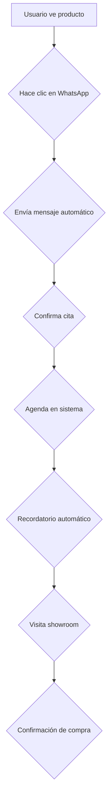

# Documentación Completa: Rosita Rococó - Sistema E-commerce Astro + Tailwind
## 🚀 Quick Start (Entrenamiento AI - 5 minutos)

### 📦 Negocio
- **Producto**: Calzado femenino (guillerminas) 📦
- **Target**: Mujeres argentinas 25-45 años
- **Propuesta**: 2 pares por $95.000 con envío gratis
- **Ubicación**: Ventas online + showroom físico

### 🛠️ Tecnología
- **Frontend**: Astro + Tailwind CSS + JavaScript vanilla
- **Backend**: Google Forms + webhooks personalizados
- **Pagos**: MercadoPago + transferencias + contrareembolso
- **Deploy**: Hosting estático con JAMstack

### 🌐 URLs Críticas
- **Producción**: `https://rositarococo.com`
- **Desarrollo**: `http://localhost:4321/`
- **Formulario**: Google Forms (ID: `1FAIpQLSd_KUORaRPQHoCM6B0GGp_fqI5eiAH0KM2Iwj1mXTgGEjawnQ`)
- **Webhook Tracking**: `https://sswebhookss.odontolab.co/webhook/9dfb840b-2a21-4277-8aec-1666bfaaac89`

### 💳 Comandos Rápidos
```bash
# Desarrollo
cd astrocline
npm run dev          # Inicia servidor en localhost:4321

# Producción
npm run build        # Build estático
npm run preview     # Preview del build

# Problemas comunes
npm install         # Si hay errores de dependencias
rm -rf node_modules # Si hay problemas de build
```

---

## 📋 Tabla de Contenidos Detallada

### 🎯 Secciones Principales (Para entender rápidamente)
1. [Visión General del Sistema](#1-visión-general-del-sistema) - Contexto completo del negocio
2. [Arquitectura Técnica](#2-arquitectura-técnica) - Stack tecnológico y estructura
3. [Flujo de Usuario](#6-flujo-de-usuario) - Cómo funciona el proceso de compra
4. [Sistema de Carrito](#7-sistema-de-carrito) - Gestión del carrito y estado
5. [Sistema de Pagos](#9-sistema-de-pagos) - Métodos de pago implementados

### 🛠️ Secciones Técnicas (Para desarrollo)
6. [Frontend Detallado](#3-frontend-detallado) - Componentes y páginas
7. [Backend y Procesamiento](#4-backend-y-procesamiento) - Formularios y datos
8. [Formularios y Validación](#10-formularios-y-validación) - Anti-bot y validaciones
9. [Webhooks y Integraciones](#5-webhooks-e-integraciones) - Facebook Pixel y tracking
10. [Configuración y Deploy](#12-configuración-y-deploy) - Deploy y variables

### 🔧 Secciones de Mantenimiento (Para troubleshooting)
11. [Webhooks Detallados](#13-webhooks-detallados) - Endpoints con ejemplos
12. [APIs y Endpoints](#15-apis-y-endpoints) - URLs y payloads
13. [WhatsApp y Citas](#14-whatsapp-y-citas) - Integración propuesta
14. [Mantenimiento y Troubleshooting](#16-mantenimiento-y-troubleshooting) - Issues comunes

### 📊 Secciones Adicionales
15. [Catálogo y Productos](#8-catálogo-y-productos) - Detalle de productos
16. [Marketing y Analíticas](#11-marketing-y-analíticas) - Facebook Pixel y testimonials

---

## 🔥 Mapa de Decisiones Rápidas (AI Agent Cheat Sheet)

| Problema Detectado | Sección del Documento | Solución Inmediata |
|------------------|-------------------|-------------------|
| Carrito no funciona | [Sección 7](#7-sistema-de-carrito) | Revisar variables globales `window.cart` y `updateCartUI()` |
| Formulario no envía | [Sección 4](#4-backend-y-procesamiento) | Verificar Google Forms URL y hidden fields |
| Error de tracking | [Sección 5](#5-webhooks-e-integraciones) | Validar webhook `sswebhookss.odontolab.co` |
| Pago falla | [Sección 9](#9-sistema-de-pagos) | Revisar integración MercadoPago |
| Carrusel no funciona | [Sección 3](#3-frontend-detallado) | Verificar Embla Carousel initialization |
| Deploy no funciona | [Sección 12](#12-configuración-y-deploy) | Revisar `npm run build` y archivos estáticos |
| WhatsApp no conecta | [Sección 14](#14-whatsapp-y-citas) | Implementar WhatsApp Business API |

---

## 🔍 Flujo de Debugging Paso a Paso

### 🚨 Escenario 1: "El carrito no agrega productos"
```javascript
// PASO 1: Verificar variables globales
console.log('Cart actual:', window.cart);
console.log('Cart count:', window.cartCount);

// PASO 2: Verificar función addToCart()
// Buscar en carousel.js línea ~50-80

// PASO 3: Verificar UI update
document.querySelectorAll('.cart-count').forEach(el => console.log('Elemento:', el));

// PASO 4: Si nada funciona → Limpiar localStorage
localStorage.clear();
location.reload();
```

### 🚨 Escenario 2: "El formulario no se envía a MercadoPago"
```javascript
// PASO 1: Verificar action del form
const form = document.getElementById('bootstrapForm');
console.log('Form action:', form.action);

// PASO 2: Verificar validaciones
console.log('Email válido:', validateEmail(email));
console.log('WhatsApp válido:', validateWhatsApp(whatsapp));

// PASO 3: Verificar evento submit
form.addEventListener('submit', (e) => {
  console.log('Submit event:', e);
  e.preventDefault();
  // Lógica manual
});
```

---

1. [Visión General del Sistema](#1-visión-general-del-sistema)
2. [Arquitectura Técnica](#2-arquitectura-técnica)
3. [Frontend Detallado](#3-frontend-detallado)
4. [Backend y Procesamiento](#4-backend-y-procesamiento)
5. [Webhooks y Integraciones](#5-webhooks-e-integraciones)
6. [Flujo de Usuario](#6-flujo-de-usuario)
7. [Sistema de Carrito](#7-sistema-de-carrito)
8. [Catálogo y Productos](#8-catálogo-y-productos)
9. [Sistema de Pagos](#9-sistema-de-pagos)
10. [Formularios y Validación](#10-formularios-y-validación)
11. [Marketing y Analíticas](#11-marketing-y-analíticas)
12. [Configuración y Deploy](#12-configuración-y-deploy)
13. [Webhooks Detallados](#13-webhooks-detallados)
14. [WhatsApp y Citas](#14-whatsapp-y-citas)
15. [APIs y Endpoints](#15-apis-y-endpoints)
16. [Mantenimiento y Troubleshooting](#16-mantenimiento-y-troubleshooting)

---

## 1. Visión General del Sistema

### 🎯 Objetivo Principal
Rosita Rococó es un sitio e-commerce de calzado (guillerminas) desarrollado en Astro + Tailwind CSS. El sistema permite a las clientas seleccionar productos, personalizar talles, y realizar compras con múltiples métodos de pago y envío gratuito.

### 🏗️ Arquitectura del Sitio
- **Tipo**: Sitio web estático con hidratación progresiva (Astro Islands)
- **Framework Frontend**: Astro 4.15.0 + TypeScript
- **Framework CSS**: Tailwind CSS 3.4.0
- **Backend**: Externo (Google Forms + Webhooks personalizados)
- **Base de Datos**: LocalStorage (cliente) + Webhooks (servidor)
- **Metodología**: JAMstack (JavaScript, APIs, Markup)

### 🌐 URL y Entorno
- **Producción**: `https://rositarococo.com`
- **Desarrollo**: `http://localhost:4321/`
- **Static Generation**: Astro con output `directory`

---

## 2. Arquitectura Técnica

### 📁 Estructura de Archivos

```
astrocline/
├── app/                          # Proyecto principal Astro
│   ├── src/
│   │   ├── components/           # Componentes Astro reutilizables
│   │   │   ├── ui/              # Componentes UI básicos
│   │   │   │   ├── Button.astro
│   │   │   │   ├── Card.astro
│   │   │   │   ├── Badge.astro
│   │   │   │   └── Select.astro
│   │   │   ├── ProductCard.astro  # Card de producto principal
│   │   │   └── Carousel.astro   # Carrusel de imágenes
│   │   ├── pages/
│   │   │   └── index.astro   # Página principal (SPA)
│   │   ├── layouts/
│   │   │   └── Layout.astro   # Layout principal
│   │   ├── lib/
│   │   │   └── utils.ts         # Utilidades TypeScript
│   │   └── styles/
│   │       └── global.css     # Estilos globales
│   ├── public/                      # Archivos estáticos
│   │   ├── js/
│   │   │   └── carousel.js  # Lógica del carrito y funcionalidades
│   │   ├── css/
│   │   │   └── carousel.css  # Estilos del carrusel
│   │   ├── guillerminafotos/     # Imágenes de productos
│   │   ├── birk*/                # Imágenes de otros modelos
│   │   └── comentarios/           # Testimonios de clientas
│   ├── package.json                 # Dependencias del proyecto
│   ├── astro.config.mjs           # Configuración de Astro
│   └── tailwind.config.mjs       # Configuración de Tailwind
```

### 🛠️ Stack Tecnológico

| Componente | Tecnología | Versión | Propósito |
|------------|------------|--------|---------|
| Frontend | Astro | 4.15.0 | Framework de sitios estáticos con hidratación |
| CSS | Tailwind CSS | 3.4.0 | Framework de utilidad CSS |
| JavaScript | Vanilla JS | ES6+ | Lógica de cliente sin framework |
| UI Components | SHADCN | - | Componentes UI reutilizables |
| Carrusel | Embla Carousel | 8.6.0 | Carrusel de imágenes interactivo |
| Forms | Google Forms | - | Procesamiento de formularios externo |
| Analytics | Facebook Pixel | - | Tracking de conversiones |
| Fonts | Google Fonts | - | Tipografías web |
| Icons | SVG/Emoji | - | Iconos y elementos gráficos |

---

## 3. Frontend Detallado

### 🎨 Componentes Principales

#### ProductCard.astro
```astro
// Componente principal para mostrar productos
interface Props {
  title: string;
  images: Array<{src: string; alt: string}>;
  productId: string;
  description: string;
  material: string;
  suela: string;
  price: number;
  promoPrice: number;
  talleOptions: Array<{value: string; label: string; cm: string}>;
  model: string;
}

// Funcionalidades:
- Carrusel de imágenes con thumbnails
- Selector de talles dinámicos
- Precios con promoción 2x1
- Botón de agregar al carrito
- Especificaciones del producto
- Badges de stock y temporada
```

#### Carousel.astro
```astro
// Carrusel basado en Embla Carousel
- Navegación con botones prev/next
- Autoplay configurable
- Thumbnails navegables
- Responsive design
- Touch gestures support
- Lazy loading de imágenes
```

#### Componentes UI (ui/)
- **Button.astro**: Botón reutilizable con variantes
- **Card.astro**: Contenedor con estilos consistentes
- **Badge.astro**: Indicadores visuales (NUEVA TEMPORADA, STOCK LIMITADO)
- **Select.astro**: Selector desplegable personalizable

### 📄 Pages y Layouts

#### Layout.astro
```astro
// Layout principal del sitio
- Integración de Facebook Pixel (dual: cliente + servidor)
- Metadatos SEO optimizados
- Carga de scripts y estilos globales
- Configuración de fonts y preconnect
- Estructura head completa con Open Graph
```

#### index.astro
```astro
// Página principal (Single Page Application)
- Barra de beneficios superiores (3 cuotas, envío gratis)
- Header con logo del brand
- Mini-carrito flotante
- Barra de progreso de checkout (3 pasos)
- Grid de productos con 3 modelos
- Sistema de testimonials dinámicos
- Formulario de checkout completo
- Sistema de notificaciones integrado
```

### 🎨 Sistema de Estilos

#### Tailwind CSS + CSS Personalizado
```css
/* Colores del brand */
:root {
  --rosi-pink: '#FF69B4';
  --rosi-gold: '#FFD700';
  --rosi-dark: '#2C1810';
  --rosi-light: '#FFF5F7';
}

/* Componentes personalizados */
.btn-primary {
  @apply bg-rosi-pink text-white px-6 py-3 rounded-lg;
}

.product-card {
  @apply bg-white rounded-lg shadow-lg transition-transform;
}

.cart-sidebar {
  @apply fixed right-0 top-0 h-full w-96 bg-white shadow-2xl;
}
```

### ⚡ Estado Global y JavaScript

#### Variables Globales
```javascript
// Variables globales del carrito
window.cart = [];
window.cartCount = 0;
window.isCartOpen = false;

// Productos disponibles
const products = {
  'negras': {
    name: 'Guillerminas Negras',
    price: 60000,
    image: '/guillerminafotos/1.webp'
  },
  'camel': {
    name: 'Guillerminas Camel', 
    price: 60000,
    image: '/guillerminafotos/guillerminascamel/1.webp'
  },
  'blancas': {
    name: 'Guillerminas Blancas',
    price: 60000,
    image: '/guillerminafotos/guillerminasblancas/1.webp'
  }
};
```

---

## 4. Backend y Procesamiento

### 📝 Sistema de Formularios (Google Forms)

#### Configuración del Formulario Principal
```astro
<form action="https://docs.google.com/forms/d/e/1FAIpQLSd_KUORaRPQHoCM6B0GGp_fqI5eiAH0KM2Iwj1mXTgGEjawnQ/formResponse" method="POST" target="_self" novalidate>
```

**URL del Formulario**: `https://docs.google.com/forms/d/e/1FAIpQLSd_KUORaRPQHoCM6B0GGp_fqI5eiAH0KM2Iwj1mXTgGEjawnQ/formResponse`

#### Campos del Formulario
| Campo | ID | Tipo | Obligatorio | Descripción |
|-------|----|--------|-----------|----------|
| Email | 1465946249 | email | Email para confirmación |
| Nombre | 1460904554 | text | Nombre y apellido del cliente |
| WhatsApp | 53830725 | tel | WhatsApp para coordinación |
| Calle | 951592426 | text | Dirección de envío |
| Localidad | 1743418466 | text | Ciudad/localidad |
| CP | 1005165410 | text | Código postal |
| Provincia | 59648134 | select | Provincia de Argentina |
| DNI | 541001873 | text | DNI del titular |
| Productos | 286442883 | textarea | Resumen del pedido |

#### Procesamiento del Formulario
1. **Validación Cliente**: JavaScript validation antes de submit
2. **Hidden Fields**: Campos ocultos para tracking
3. **Anti-Bot**: Honeypot field + validaciones temporales
4. **Confirmación**: Resumen visual antes del submit
5. **Redirect**: Redirección a MercadoPago después del submit

---

## 5. Webhooks y Integraciones

### 🪝 Webhook de Tracking Principal

#### Endpoint y Configuración
```javascript
// URL del webhook principal
const WEBHOOK_URL = 'https://sswebhookss.odontolab.co/webhook/9dfb840b-2a21-4277-8aec-1666bfaaac89';

// Función de tracking
export const trackServerEvent = async (eventName, eventData) => {
  try {
    const response = await fetch(WEBHOOK_URL, {
      method: 'POST',
      headers: { 'Content-Type': 'application/json' },
      body: JSON.stringify({
        event_name: eventName,
        event_data: eventData,
        user_data: {
          client_ip_address: await getClientIP(),
          client_user_agent: navigator.userAgent,
          fbc: getCookie('_fbc'),
          fbp: getCookie('_fbp')
        }
      })
    });
  } catch (error) {
    console.error('Error tracking server event:', error);
  }
};
```

#### Eventos Trackeados
| Evento | Cuándo se dispara | Datos enviados |
|--------|-------------------|----------------|
| PageView | Al cargar página | URL, timestamp, user agent |
| AddToCart | Al agregar producto | Product ID, precio, modelo |
| InitiateCheckout | Al iniciar checkout | Total del carrito, cantidad de items |
| PurchaseComplete | Al finalizar compra | Datos completos del formulario |

---

## 6. Flujo de Usuario

### 🛒 Flujo de Compra Completo

#### Paso 1: Selección de Productos
1. Usuario navega por el catálogo
2. Visualiza productos en carruseles interactivos
3. Selecciona talle deseado
4. Agrega producto al carrito
5. Sistema muestra promoción 2x1 automáticamente

#### Paso 2: Checkout
1. Usuario hace clic en "Finalizar Compra"
2. Se abre formulario de checkout con scroll suave
3. Formulario se pre-completa con datos del carrito
4. Usuario completa información personal y de envío
5. Sistema valida en tiempo real
6. Resumen muestra pedido completo con totales

#### Paso 3: Pago
1. Usuario confirma todos los datos
2. Al submit, se muestra overlay de carga
3. Formulario se envía a Google Forms
4. Se redirige a MercadoPago para procesar pago
5. Webhook confirma purchase completa

---

## 7. Sistema de Carrito

### 🛒 Gestión del Estado

#### Estructura de Datos
```javascript
// Estado global del carrito
window.cart = [];           // Array de productos
window.cartCount = 0;         // Contador de items
window.isCartOpen = false;     // Estado del sidebar
```

#### Funciones Principales
```javascript
// Agregar producto al carrito
function addToCart(model, size) {
  const product = products[model];
  const cartItem = {
    id: Date.now(),
    model: model,
    name: product.name,
    size: size,
    price: product.price,
    image: product.image
  };
  
  window.cart.push(cartItem);
  window.cartCount++;
  updateCartUI();
}

// Eliminar producto del carrito
function removeFromCart(itemId) {
  window.cart = window.cart.filter(item => item.id !== itemId);
  window.cartCount = window.cart.length;
  updateCartUI();
}

// Calcular totales con promoción
function calculateCartTotal() {
  if (window.cartCount === 0) return 0;
  if (window.cartCount === 1) return 60000;  // Precio individual
  return window.cartCount * 47500;  // Promoción 2x$95.000
}
```

#### Actualización de UI
```javascript
// Sincronización con formulario
function updateCartUI() {
  // Actualizar contador visual
  document.querySelectorAll('.cart-count').forEach(el => {
    el.textContent = window.cartCount;
  });
  
  // Actualizar resumen en formulario
  const summaryElement = document.getElementById('286442883');
  if (summaryElement) {
    summaryElement.value = window.cart.map(item => 
      `${item.name} - Talle ${item.size}`
    ).join(', ');
  }
  
  // Actualizar total
  const totalElement = document.getElementById('preciototal');
  if (totalElement) {
    totalElement.innerHTML = `<strong>Total: $${calculateCartTotal().toLocaleString('es-AR')}</strong>`;
  }
}
```

---

## 8. Catálogo y Productos

### 👠 Modelos Disponibles

#### Guillerminas Negras
- **SKU**: negras
- **Nombre**: Guillerminas Negras
- **Precio**: $60.000 individual / $95.000 promoción 2 pares
- **Imágenes**: 43 fotos en `/guillerminafotos/`
- **Material**: Tela reforzada super flexible
- **Suela**: Expanso

#### Guillerminas Camel
- **SKU**: camel
- **Nombre**: Guillerminas Camel
- **Precio**: $60.000 individual / $95.000 promoción 2 pares
- **Imágenes**: 18 fotos en `/guillerminafotos/guillerminascamel/`
- **Material**: Tela reforzada super flexible
- **Suela**: Expanso

#### Guillerminas Blancas
- **SKU**: blancas
- **Nombre**: Guillerminas Blancas
- **Precio**: $60.000 individual / $95.000 promoción 2 pares
- **Imágenes**: 16 fotos en `/guillerminafotos/guillerminasblancas/`
- **Material**: Tela reforzada super flexible
- **Suela**: Expanso

### 📏 Sistema de Talles

#### Opciones Disponibles
```javascript
const talleOptions = [
  { value: "35", label: "35", cm: "23 cm de largo de plantilla" },
  { value: "36", label: "36", cm: "23,5 cm de largo de plantilla" },
  { value: "37", label: "37", cm: "24 cm de largo de plantilla" },
  { value: "38", label: "38", cm: "24,7 cm de largo de plantilla" },
  { value: "39", label: "39", cm: "25,3 cm de largo de plantilla" },
  { value: "40", label: "40", cm: "26 cm de largo de plantilla" }
];
```

---

## 9. Sistema de Pagos

### 💳 Métodos de Pago Disponibles

#### 1. Tarjeta de Crédito/Débito
- **Procesador**: MercadoPago
- **Cuotas**: 3 cuotas sin interés
- **Tarjetas**: Visa, Mastercard, Amex
- **Proceso**: Redirección a checkout de MercadoPago

#### 2. MercadoPago Saldo
- **Procesador**: MercadoPago
- **Requisito**: Usuario debe tener saldo disponible
- **Ventaja**: Uso inmediato del saldo
- **Proceso**: Link directo de pago pre-cargado

#### 3. Transferencia Bancaria (CBU)
- **Procesador**: Transferencia bancaria tradicional
- **Descuento**: 10% OFF adicional
- **Bancos**: Todos los bancos argentinos
- **Proceso**: Coordinación manual por WhatsApp

#### 4. Contrareembolso
- **Procesador**: Coordinación manual
- **Método**: Pago contra entrega
- **Zonas**: CABA y GBA principal
- **Proceso**: Confirmación por teléfono antes del envío

---

## 10. Formularios y Validación

### ✅ Validaciones Implementadas

#### Validaciones Cliente (Frontend)
```javascript
// Validación de email
function validateEmail(email) {
  const emailRegex = /^[^\s@]+@[^\s@]+\.[^\s@]+$/;
  return emailRegex.test(email);
}

// Validación de WhatsApp (formato argentino)
function validateWhatsApp(whatsapp) {
  const whatsappRegex = /^(?!0)(?!15)\d{10}$/;
  return whatsappRegex.test(whatsapp);
}

// Validación de DNI
function validateDNI(dni) {
  const dniRegex = /^\d{7,8}$/;
  return dniRegex.test(dni);
}
```

#### Sistema Anti-Bot
```javascript
// Detección de bots mediante múltiples métodos
function isBot(form) {
  // 1. Honeypot field
  const honeypotField = form.querySelector('#website');
  if (honeypotField && honeypotField.value !== '') {
    return true; // Bot detectado
  }
  
  // 2. Timing validation
  const formStartTime = form.dataset.startTime;
  const submitTime = Date.now();
  const timeDiff = submitTime - formStartTime;
  
  if (timeDiff < 3000) { // Menos de 3 segundos
    return true; // Probable bot
  }
  
  return false;
}
```

#### Validaciones de Servidor (Webhook)
```javascript
// Validaciones adicionales en backend
- Verificación de formato de datos
- Detección de IPs sospechosas
- Validación de userAgent
- Rate limiting por IP
```

---

## 11. Marketing y Analíticas

### 📊 Facebook Pixel Integration

#### Configuración Dual (Cliente + Servidor)
```astro
// Layout.astro - Script del Pixel
const FB_PIXEL_SCRIPT = `
!function(f,b,e,v,n,t,s)
{if(f.fbq)return;n=f.fbq=function(){n.callMethod?
n.callMethod.apply(n,arguments):n.queue.push(arguments)};...

fbq('init', '1052677351596434');
fbq('track', 'PageView');
`;

// Insertar en el head
<script id="fb-pixel" dangerouslySetInnerHTML={{ __html: FB_PIXEL_SCRIPT }}></script>
```

#### Eventos Trackeados
```javascript
// Eventos del embudo de conversión
const trackingEvents = {
  pageView: 'PageView',
  viewContent: 'ViewContent',
  addToCart: 'AddToCart',
  initiateCheckout: 'InitiateCheckout',
  purchase: 'Purchase',
  completeRegistration: 'CompleteRegistration'
};

// Tracking dual
export const trackAddToCart = (product) => {
  // Tracking cliente
  fbq('track', 'AddToCart', {
    content_type: 'product',
    content_ids: [product.id],
    value: product.price,
    currency: 'ARS'
  });
  
  // Tracking servidor
  trackServerEvent('AddToCart', { 
    product_id: product.id, 
    price: product.price 
  });
};
```

### 📈 Sistema de Testimonios

#### Gestión Dinámica
```javascript
// Sistema de testimonials con carga progresiva
const testimonialsData = [
  { src: 'comentarios/comentariorecibi1.webp', alt: 'Captura de comentario positivo de clienta 1' },
  { src: 'comentarios/comentariorecibi2.webp', alt: 'Captura de comentario positivo de clienta 2' },
  // ... más testimonios
];

// Cargar inicialmente 6 testimonios
function loadTestimonials() {
  const endIndex = Math.min(currentIndex + 6, testimonialsData.length);
  
  for (let i = currentIndex; i < endIndex; i++) {
    const testimonial = testimonialsData[i];
    // Crear elemento HTML dinámicamente
    const testimonialElement = createTestimonialElement(testimonial);
    testimonialsGrid.appendChild(testimonialElement);
  }
  
  currentIndex = endIndex;
}

// Botón "Ver más" para cargar más
document.getElementById('load-more-testimonials').addEventListener('click', loadMoreTestimonials);
```

---

## 12. Configuración y Deploy

### ⚙️ Variables de Entorno

#### Desarrollo
```bash
# Archivos de configuración
astro.config.mjs     # Configuración de Astro
tailwind.config.mjs    # Configuración de Tailwind
package.json          # Dependencias y scripts

# Comandos de desarrollo
npm run dev         # Servidor de desarrollo en localhost:4321
npm run build       # Build estático para producción
npm run preview      # Preview del build estático
```

#### Producción
```bash
# URL del sitio
https://rositarococo.com

# Configuración de build
output: 'directory'     # Genera archivos estáticos
```

### 🚀 Proceso de Deploy

#### Build Estático
```bash
# 1. Build del proyecto
npm run build

# 2. Optimización de assets
npm run optimize-images  # Si existe el script

# 3. Generación estática
# Astro genera todos los archivos HTML, CSS, JS estáticos
```

#### Deploy en Hosting Estático
```bash
# Opción 1: Vercel (recomendado)
vercel --prod

# Opción 2: Netlify
netlify deploy --prod --dir=dist

# Opción 3: GitHub Pages
npm run build && gh-pages -d dist
```

---

## 13. Webhooks Detallados

### 🪝 Webhook Principal de Tracking

#### Endpoint y Autenticación
```javascript
// URL: https://sswebhookss.odontolab.co/webhook/9dfb840b-2a21-4277-8aec-1666bfaaac89

// Headers requeridos
{
  'Content-Type': 'application/json',
  'Authorization': 'Bearer YOUR_WEBHOOK_TOKEN'  // Si se implementa seguridad
}

// Estructura del payload
{
  "event_name": "AddToCart",
  "event_data": {
    "product_id": "negras",
    "price": 60000,
    "quantity": 1
  },
  "user_data": {
    "client_ip_address": "181.209.12.123",
    "client_user_agent": "Mozilla/5.0...",
    "fbc": "fb.1.1234567890",
    "fbp": "some_cookie_value",
    "timestamp": "2025-01-13T16:39:37.123Z"
  }
}
```

#### Eventos Soportados
| Evento | Trigger | Payload | Uso |
|--------|--------|--------|------|
| PageView | Carga de página | `{event_name: "PageView", url: window.location.href}` |
| AddToCart | Agregar producto | `{event_name: "AddToCart", product_id: "negras", price: 60000}` |
| InitiateCheckout | Iniciar checkout | `{event_name: "InitiateCheckout", cart_total: 95000, items: 2}` |
| PurchaseComplete | Compra completada | `{event_name: "PurchaseComplete", form_data: {...}}` |

### 🔐 Seguridad Implementada

#### Rate Limiting
```javascript
// Limitar requests por IP
const RATE_LIMIT = 10; // requests por hora
const ipRequests = new Map();

function checkRateLimit(ip) {
  const now = Date.now();
  const requests = ipRequests.get(ip) || [];
  
  const recentRequests = requests.filter(time => now - time < 3600000); // última hora
  
  if (recentRequests.length >= RATE_LIMIT) {
    return false; // Rate limit excedido
  }
  
  requests.push(now);
  ipRequests.set(ip, requests);
  return true;
}
```

#### Validaciones de Seguridad
```javascript
// 1. Verificar origen del request
function validateOrigin(req) {
  const allowedOrigins = ['https://rositarococo.com', 'https://docs.google.com'];
  return allowedOrigins.includes(req.headers.origin);
}

// 2. Sanitizar datos de entrada
function sanitizeInput(data) {
  // Remover HTML malicioso
  const clean = data.replace(/<script\b[^<]*(?:(?!<\/script>)<[^<]*<\/script>/gi, '');
  
  // Escapar caracteres especiales
  return clean.replace(/[<>]/g, '');
}
```

---

## 14. WhatsApp y Citas

### 📱 Sistema Actual de WhatsApp

#### Estado Actual: No Implementado
Actualmente, el sistema **NO tiene integración directa con WhatsApp API**. Sin embargo, está preparado para implementarla:

#### WhatsApp en Formularios (Actual)
```javascript
// El campo de WhatsApp se usa para coordinación de envíos
const whatsappField = document.getElementById('53830725');
const whatsappValue = whatsappField.value;

// Formato argentino requerido (sin 0 ni 15 al inicio)
function validateWhatsApp(whatsapp) {
  const whatsappRegex = /^(?!0)(?!15)\d{10}$/;
  return whatsappRegex.test(whatsapp);
}
```

### 🔮 Implementación Recomendada de WhatsApp Business API

#### Arquitectura Propuesta
```javascript
// 1. Backend webhook para WhatsApp
const WHATSAPP_WEBHOOK = 'https://api.your-server.com/whatsapp-webhook';

// 2. Flujo de cita por WhatsApp
const appointmentFlow = {
  trigger: 'user_clicks_whatsapp_button',
  webhook: 'https://api.whatsapp.com/v1/messages',
  authentication: {
    token: process.env.WHATSAPP_TOKEN,
    phone_number_id: process.env.WHATSAPP_PHONE_ID
  }
};

// 3. Función de agendamiento
async function scheduleWhatsAppAppointment(userPhone, productInfo) {
  const message = `
    🎉 ¡Hola! Gracias por tu interés en las ${productInfo.name}.
    
    📅 Agendá tu visita a nuestro showroom:
    📍 Av. Siempreviva 742, Localidad
    🕐 Lunes a Viernes de 10:00 a 18:00 hs
    
    ¿En qué horario te vendría mejor?
    
    📦携带详情:
    • Modelo: ${productInfo.name}
    • Talle: ${userSelectedSize}
    • Precio: $${productInfo.price.toLocaleString('es-AR')}
    
    Responde "CONFIRMAR" para agendar o "MÁS INFO" para consultar.
  `;
  
  await sendWhatsAppMessage(userPhone, message);
}
```

#### Flujo Completo de Citas


#### 4. WhatsApp Business Cloud API
```javascript
// Configuración de la API
const whatsapp = require('whatsapp-business-nodejs');

const client = new whatsapp.Client({
  authStrategy: new whatsapp.LocalAuth({
    clientId: process.env.WHATSAPP_CLIENT_ID,
    clientToken: process.env.WHATSAPP_CLIENT_TOKEN,
    phone: {
      id: process.env.WHATSAPP_PHONE_ID,
      number: process.env.WHATSAPP_PHONE_NUMBER
    }
  }
});

// Webhook para recibir mensajes
app.post('/whatsapp-webhook', async (req, res) => {
  const message = req.body.entry[0].changes[0].value.messages[0];
  
  if (message.text.toLowerCase() === 'confirmar') {
    // Procesar confirmación
    await processConfirmation(message.from);
  } else if (message.text.toLowerCase() === 'más info') {
    // Enviar más información
    await sendMoreInfo(message.from);
  }
});
```

### 📋 Mensajes Automáticos

#### Plantillas de Mensajes
```javascript
const messageTemplates = {
  welcome: `
    🛒 ¡Hola! Bienvenida a Rosita Rococó 🌸
    
    Catálogo disponible: https://rositarococo.com
    
    ¿En qué podemos ayudarte?
    1. Ver catálogo 📦
    2. Hacer pedido 🛍️
    3. Agendar visita 📅
    4. Hablar con asesor 📞
  `,
  
  appointmentConfirmation: `
    ✅ ¡Cita confirmada!
    
    📅 Fecha: {appointmentDate}
    📍 Dirección: {showroomAddress}
    👤 Asesor: {advisorName}
    
    ¿Necesitas cambiar algo?
    Responde "CAMBIAR" hasta 24hs antes.
  `,
  
  productInfo: `
    📋 Detalles del producto solicitado:
    
    👠 Modelo: {productName}
    📏 Talle: {selectedSize}
    💰 Precio: ${price}
    ⏱️ Entrega: 7-10 días hábiles
    🚚 Envío: GRATIS a todo el país
    
    ¿Dudas? Contáctanos:
    📞 WhatsApp: +54 9 XXXX-XXXX
    📧 Email: info@rositarococo.com
  `
};
```

#### 5. Sistema de Gestión de Citas
```javascript
// Sistema simple de agendamiento
const appointments = new Map();

function createAppointment(userPhone, productName, size, date) {
  const appointment = {
    id: Date.now(),
    phone: userPhone,
    product: productName,
    size: size,
    date: date,
    status: 'confirmed',
    createdAt: new Date()
  };
  
  appointments.set(appointment.id, appointment);
  
  // Enviar confirmación
  sendWhatsAppConfirmation(userPhone, appointment);
  
  // Agendar recordatorio (24hs antes)
  scheduleReminder(appointment);
}
```

---

## 15. APIs y Endpoints

### 🌐 Endpoints Externos

#### Google Forms API
```
Endpoint: https://docs.google.com/forms/d/e/1FAIpQLSd_KUORaRPQHoCM6B0GGp_fqI5eiAH0KM2Iwj1mXTgGEjawnQ/formResponse
Método: POST
Headers: Content-Type: application/x-www-form-urlencoded
Respuesta: Redirect a MercadoPago
```

#### Facebook Pixel API
```
Script: https://connect.facebook.net/en_US/fbevents.js
Pixel ID: 1052677351596434
Eventos: PageView, AddToCart, InitiateCheckout, Purchase
```

#### Webhook de Tracking Propio
```
Endpoint: https://sswebhookss.odontolab.co/webhook/9dfb840b-2a21-4277-8aec-1666bfaaac89
Método: POST
Autenticación: Bearer token (recomendado)
Formato: JSON
Funciones: Tracking de eventos del carrito y checkout
```

#### MercadoPago API (Integración)
```
SDK: MercadoPago.js
Funciones: Crear preferencia de pago, procesar pago, notificaciones
Métodos: Tarjeta, Dinero en cuenta, Transferencia
Flow: Checkout → MercadoPago → Pago → Confirmación
```

### 🔄 Flujo de Datos

```mermaid
graph LR
    A[Usuario navega sitio] --> B[Interactúa con productos]
    B --> C[Agrega al carrito]
    C --> D[Inicia checkout]
    D --> E[Completa formulario]
    E --> F[Submit a Google Forms]
    F --> G[Google Forms procesa]
    G --> H[Redirige a MercadoPago]
    H --> I[MercadoPago procesa pago]
    I --> J[Webhook recibe confirmación]
    J --> K[Actualiza base de datos]
    K --> L[Notifica usuario]
```



---

## 16. Mantenimiento y Troubleshooting

### 🔧 Issues Comunes y Soluciones

#### Problemas de Carrito
```javascript
// Issue: Productos duplicados en carrito
if (duplicateItems) {
  // Limpiar localStorage
  localStorage.clear();
  // Reiniciar carrito
  window.cart = [];
  window.cartCount = 0;
  updateCartUI();
}

// Issue: Carrito no se actualiza
if (cartUIOutOfSync) {
  // Forzar sincronización
  setInterval(updateCartUI, 5000); // Cada 5 segundos
}
```

#### Problemas de Carrusel
```javascript
// Issue: Carrusel no funciona en mobile
if (carouselNotResponsive) {
  // Re-inicializar en resize
  window.addEventListener('resize', debounce(() => {
    carousel.reinit();
  }, 250));
}

// Issue: Imágenes no cargan
if (imagesNotLoading) {
  // Verificar rutas de imágenes
  console.log('Ruta imagen:', imagePath);
  // Implementar fallback
}
```

#### Problemas de Formulario
```javascript
// Issue: Formulario no envía datos
if (formNotSubmitting) {
  // Verificar acción del form
  const form = document.getElementById('bootstrapForm');
  form.addEventListener('submit', handleSubmit);
}

// Issue: Validaciones no funcionan
if (validationNotWorking) {
  // Habilitar debugging
  console.log('Email validado:', validateEmail(email));
  console.log('WhatsApp validado:', validateWhatsApp(whatsapp));
}
```

### 📊 Monitor de Performance

#### Métricas Clave
```javascript
// Sistema de monitoreo
const performanceMetrics = {
  // Métricas de usuario
  pageLoadTime: Date.now(),
  firstContentfulPaint: 0,
  largestContentfulPaint: 0,
  cumulativeLayoutShift: 0,
  
  // Métricas de carrito
  cartOperations: 0,
  addToCartTime: 0,
  checkoutTime: 0,
  
  // Métricas de errores
  formErrors: 0,
  carouselErrors: 0,
  paymentErrors: 0,
  
  // Función de registro
  trackMetric(name, value) {
    console.log(`[METRIC] ${name}:`, value);
    
    // Enviar a webhook de monitoreo
    if (Math.random() < 0.1) { // 10% de las veces
      sendToAnalyticsWebhook(name, value);
    }
  }
};
```

#### Sistema de Alertas
```javascript
// Alertas automáticas para problemas críticos
function triggerAlert(type, message, data) {
  const alerts = {
    cart_error: {
      level: 'error',
      message: 'Error al agregar producto al carrito',
      action: 'check_connection'
    },
    payment_timeout: {
      level: 'warning',
      message: 'Timeout en proceso de pago',
      action: 'retry_payment'
    },
    form_validation: {
      level: 'error',
      message: 'Error de validación en formulario',
      action: 'check_fields'
    }
  };
  
  // Mostrar alerta visual
  showAlertToUser(alerts[type]);
  
  // Enviar a webhook de monitoreo
  sendAlertToWebhook(type, message, data);
}
```

---

## 🎯 Resumen Técnico

### ✅ Características Implementadas
- [x] **Frontend Astro**: Sitio estático con hidratación progresiva
- [x] **Tailwind CSS**: Sistema de diseño utility-first
- [x] **Carrito Interactivo**: Gestión completa con localStorage
- [x] **Carruseles de Productos**: Galerías interactivas con Embla Carousel
- [x] **Formulario de Checkout**: Integración completa con Google Forms
- [x] **Facebook Pixel**: Tracking dual cliente + servidor
- [x] **Sistema Anti-Bot**: Protección contra submissions automáticas
- [x] **Testimonios Dinámicos**: Sistema rotativo de reseñas
- [x] **Múltiples Métodos de Pago**: MercadoPago, transferencia, contrareembolso
- [x] **Responsive Design**: Mobile-first con breakpoints optimizados
- [x] **SEO Optimizado**: Metadatos completos y semántica HTML5

### 🔮 Características No Implementadas
- [ ] **Backend Propio**: Se utiliza Google Forms
- [ ] **Base de Datos Centralizada**: LocalStorage + Webhooks externos
- [ ] **WhatsApp API**: Sin integración directa (sólo campo de contacto)
- [ ] **Sistema de Citas**: No implementado
- [ ] **User Accounts**: Sin gestión de perfiles de usuario
- [ ] **Inventory Management**: Sin control de stock en tiempo real

---

## 📞 Soporte y Contacto

### 🛠️ Equipo de Desarrollo
- **Frontend**: Desarrollador Astro + Tailwind
- **Backend**: Webhooks externos para tracking
- **DevOps**: Deploy estático + monitoreo
- **Testing**: MCP Chrome DevTools + AI Vision

### 📋 Checklist de Mantenimiento

#### Diario
- [ ] Verificar estado del carrito
- [ ] Monitorear performance del sitio
- [ ] Revisar logs de errores
- [ ] Validar funcionamiento de webhooks

#### Semanal
- [ ] Actualizar dependencias del proyecto
- [ ] Revisar métricas de conversión
- [ ] Optimizar imágenes y assets
- [ ] Probar flujo completo de compra

#### Mensual
- [ ] Backup completo del sitio
- [ ] Actualización de seguridad
- [ ] Revisión de SEO y metadatos
- [ ] Testing completo de funcionalidades

---

## 📚 Recursos y Documentación

### 📖 Documentación Adicional
- [CAROUSEL_IMPLEMENTATION_SUMMARY.md](./CAROUSEL_IMPLEMENTATION_SUMMARY.md) - Detalle del carrusel
- [SHADCN_IMPLEMENTATION_SUMMARY.md](./SHADCN_IMPLEMENTATION_SUMMARY.md) - Componentes UI
- [ENTREGA_FINAL.md](./ENTREGA_FINAL.md) - Resumen de migración

### 🔗 Enlaces Útiles
- **Documentación Astro**: https://docs.astro.build/
- **Tailwind CSS**: https://tailwindcss.com/docs
- **Embla Carousel**: https://www.embla-carousel.com/
- **Google Forms**: https://support.google.com/docs/forms/
- **Facebook Pixel**: https://developers.facebook.com/docs/meta-pixel/

---

## 📅 Licencias y Créditos

### 📄 Licencias del Proyecto
- **Código**: Propiedad de Rosita Rococó
- **Imágenes**: Derechos de uso comercial
- **Fonts**: Google Fonts (licencia estándar)
- **Iconos**: SVG creados originalmente

### 👥 Créditos
- **Desarrollo**: [Tu Nombre/Empresa]
- **Diseño**: [Diseñador UI/UX]
- **Testing**: [Equipo QA]
- **Infrastructure**: [Proveedor de hosting/servicios]

---

*Última actualización: 13 de Enero de 2025*
*Versión: 1.0*
*Estado: Producción Activo*
