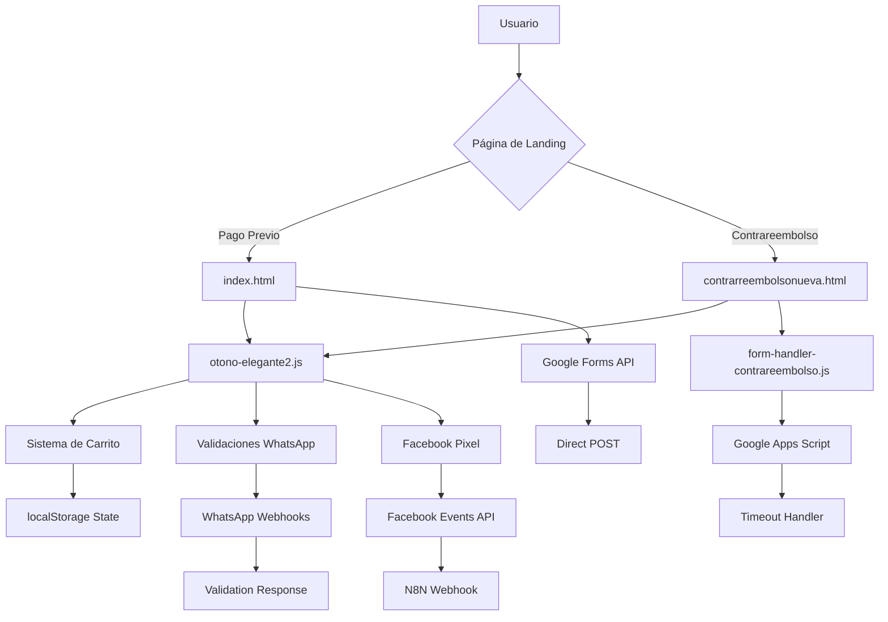

# Documentación Definitiva - Ecosistema Web Rosita Rococó

## 1. RESUMEN EJECUTIVO

### 1.1 Overview del Proyecto

Rosita Rococó es un ecommerce especializado en la venta de zapatos deportivos/urbanos (Guillerminas) que opera con **dos modelos de negocio diferenciados** para optimizar conversiones según el perfil del cliente:

- **Sistema de Pago Previo**: Para clientes que prefieren pagar por adelantado con descuentos
- **Sistema de Contrarreembolso**: Para clientes que prefieren pagar al recibir el producto

### 1.2 Sistemas Principales

#### 🎯 **Core Business Systems**
- **Sistema de Pago Previo** (`index.html`) - Venta con pago anticipado
- **Sistema de Contrarreembolso** (`contrarreembolsonueva.html`) - Venta contra reembolso
- **Sistema de Carrito Unificado** - Gestión sincronizada entre ambos sistemas

#### 🔧 **Sistemas de Soporte**
- **Chat Widgets Inteligentes** - Asistencia personalizada por sistema
- **Sistema de Testimonios Dinámico** - 27+ testimonios con carga progresiva
- **Validación WhatsApp en Tiempo Real** - Verificación inmediata de números
- **Tracking Dual Facebook** - Client-side y server-side para máxima precisión

#### 🌐 **Integraciones Externas**
- **Google Forms API** (Pago Previo)
- **Google Apps Script** (Contrareembolso)
- **Facebook Pixel + Events API**
- **Múltiples Webhooks** (WhatsApp, Chat, Validaciones)

### 1.3 Arquitectura General

```
┌─────────────────────────────────────────────────────────────┐
│                    ROSITA ROCOCÓ ECOSYSTEM                   │
├─────────────────────────────────────────────────────────────┤
│  FRONTEND LAYER                                            │
│  ├── index.html (Pago Previo)                              │
│  ├── contrareembolsonueva.html (Contrareembolso)           │
│  └──Páginas de confirmación (gracias-*.html)              │
├─────────────────────────────────────────────────────────────┤
│  JAVASCRIPT CORE                                           │
│  ├── otono-elegante2.js (Lógica Unificada)                 │
│  ├── form-handler-contrareembolso.js                      │
│  └── Múltiples archivos de fix y optimización              │
├─────────────────────────────────────────────────────────────┤
│  INTEGRATION LAYER                                         │
│  ├── Google Forms/Apps Script (Formularios)               │
│  ├── Facebook Pixel/Events API (Tracking)                 │
│  ├── WhatsApp API (Validaciones)                          │
│  └── Chat Webbots (Asistencia)                            │
├─────────────────────────────────────────────────────────────┤
│  EXTERNAL SERVICES                                         │
│  ├── sswebhookss.odontolab.co (Webhooks)                  │
│  ├── api.ipify.org (IP Detection)                         │
│  └── Multiple CDN Resources                               │
└─────────────────────────────────────────────────────────────┘
```

---

## 2. ARQUITECTURA DEL SISTEMA

### 2.1 Flujos de Usuario Principales

#### 🚀 **Flujo Pago Previo**
```
Landing → Selección Producto → Carrito → Checkout → Google Forms → Confirmación
   ↓           ↓              ↓         ↓           ↓              ↓
Tracking   Guillerminas   Sincronizado  Validación  POST Directo  Gracias
Facebook   43 imágenes    Unificado    Completa    API           Página
```

#### 💰 **Flujo Contrarreembolso**
```
Landing → Selección Producto → Carrito → Checkout → Google Apps Script → Confirmación
   ↓           ↓              ↓         ↓           ↓                      ↓
Tracking   Milán/Trento/   Sincronizado  Validación  AJAX Handler        Gracias
Facebook   Parma          Unificado    WhatsApp   Timeout               Específico
```

### 2.2 Páginas y Sistemas

#### 📄 **Páginas Principales**
| Página | Propósito | Sistema | Productos | Endpoint Formulario |
|--------|-----------|---------|-----------|-------------------|
| `index.html` | Pago Previo | Prepagado | Guillerminas Negras | Google Forms API |
| `contrarreembolsonueva.html` | Contrarreembolso | Contra reembolso | Milán, Trento, Parma | Google Apps Script |
| `gracias-1par-c.html` | Confirmación 1 par | CR | - | - |
| `gracias-2pares-c.html` | Confirmación 2 pares | CR | - | - |
| `gracias-3pares.html` | Confirmación 3+ pares | CR | - | - |

#### 🎛️ **Sistemas de Gestión**
- **Sistema de Carrito Unificado**: Manejo sincronizado entre páginas
- **Sistema de Validación**: WhatsApp, productos, formularios
- **Sistema de Tracking**: Facebook dual (client + server)
- **Sistema de Chat**: Widgets diferenciados por sistema

### 2.3 Relaciones entre Componentes



---

## 3. SISTEMAS DETALLADOS

### 3.1 Sistema de Pago Previo

#### 📄 **Archivo Principal**: `index.html`

##### **Estructura HTML**
```html
<body>
├── Anti-bot Honeypot Field
├── Top Benefits Bar (3 CUOTAS SIN INTERÉS, ENVÍO GRATIS)
├── Mini Cart System (Flotante)
├── Checkout Progress Bar (3 steps)
├── Product Grid (Guillerminas Negras - 43 imágenes)
├── Checkout Form Section
├── WhatsApp Modal
└── Testimonials Section (Sistema dinámico)
</body>
```

##### **Formulario Principal**
- **Target**: Google Forms API
- **URL**: `https://docs.google.com/forms/d/e/1FAIpQLSd_KUORaRPQHoCM6B0GGp_fqI5eiAH0KM2Iwj1mXTgGEjawnQ/formResponse`
- **Method**: POST directo
- **Action**: `target="_self"`

**Campos del Formulario**:
```javascript
const pagoPrevioFields = {
    landing_url: "entry.1209868979",     // URL de landing (oculto)
    mercadopago_link: "entry.978809450", // Link MercadoPago (oculto)
    products_summary: "entry.286442883", // Resumen productos
    customer_name: "entry.1211347450",   // Nombre del cliente
    whatsapp: "entry.501094818",         // Número WhatsApp
    address: "entry.394819614",          // Calle y altura
    locality: "entry.2081271241",        // Localidad
    province: "entry.1440375758",        // Provincia
    postal_code: "entry.183290493",      // Código postal
    delivery_time: "entry.1756027935"    // Día y hora de entrega
};
```

##### **Funcionalidades Específicas**
- **Productos**: 3 líneas: Negras, Camel, Blancas
- **Precio**: $70.000 (1 par) / $55.000 c/u (2+ pares)
- **Promoción**: "3 CUOTAS SIN INTERÉS"
- **Chat Widget**: Promo específica "2x$110.000"

##### **Hooks y Webhooks**
```javascript
// Facebook Pixel Events
fbq('track', 'PageView');
fbq('track', 'AddToCart');
fbq('track', 'InitiateCheckout');
fbq('track', 'Purchase');

// WhatsApp Validation
const validateWhatsappEndpoint = "https://sswebhookss.odontolab.co/webhook/02eb0643-1b9d-4866-87a7-f892d6a945ea";

// Chat Widget
const chatApiUrl = 'https://sswebhookss.odontolab.co/webhook/0bf290e4-f5d5-4a22-94f5-a88cbbf9b347/chat';
```

### 3.2 Sistema Contrareembolso

#### 📄 **Archivos Principales**: 
- `contrarreembolsonueva.html` (HTML Principal)
- `form-handler-contrareembolso.js` (Lógica de Formularios)

##### **Diferencias Estructurales Clave**
```javascript
const contrareembolsoConfig = {
    products: ['milán', 'trento', 'parma'], // vs Guillerminas en pago previo
    pricing: {
        1: 55000,  // 1 par = $55.000
        2: 42500   // 2+ pares = $42.500 c/u
    },
    promotions: "2x$85.000", // vs "2x$110.000" pago previo
    deliveryWindow: "15hs a 22hs",
    paymentMethod: "Efectivo al delivery"
};
```

##### **Formulario Principal**
- **Target**: Google Apps Script
- **URL**: `https://script.google.com/macros/s/AKfycbzGtF3OryfbupUz-8IlK1K4Ew0P0H1QSjabGnsHcswkbDzldXLWPDEdF26tLUkSjz6MSQ/exec`
- **Method**: AJAX POST con manejo de errores
- **Timeout**: 30 segundos con fallback

##### **Validaciones Específicas CR**
```javascript
// Validación de productos contrareembolso
function validateContrareembolsoProducts(selectedProducts) {
    const pairs = selectedProducts.split(', ').filter(Boolean);
    const unitPrice = pairs.length === 1 ? 55000 : 42500;
    const totalValue = pairs.length === 1 ? 55000 : pairs.length * 42500;
    
    return { 
        totalItems: pairs.length, 
        unitPrice, 
        totalValue,
        isValid: validateProductFormat(pairs)
    };
}

// Formato de productos: "talle-modelo-color"
const productExamples = [
    "36-milan-negro",
    "38-trento-blanco", 
    "40-parma-marron"
];
```

##### **Sistema de Timeout y Manejo de Errores**
```javascript
// Timeout de 30 segundos
const timeoutId = setTimeout(() => {
    console.error('⏰ [Form Handler] TIMEOUT: El envío ha tardado más de 30 segundos');
    $('.loading-overlay').removeClass('visible');
    $('#botoncomprar').val('COMPRAR 🛒').prop('disabled', false);
    alert('El proceso está tardando más de lo normal. Por favor, intenta nuevamente.');
}, 30000);

// Manejo de respuesta exitosa
.done(function(response) {
    clearTimeout(timeoutId);
    console.log('✅ [Form Handler] ¡ENVÍO EXITOSO!', response);
    
    // Redirección según cantidad de productos
    const redirectUrl = getRedirectUrl(pairs.length);
    window.location = redirectUrl + '?' + queryString;
});
```

##### **Instrucciones de Entrega Específicas**
```javascript
const contrareembolsoInstructions = {
    contactWhatsApp: "Apenas realices tu pedido te contactaremos por WhatsApp",
    paymentMethod: "Pago en efectivo al delivery",
    deliveryWindow: "15hs a 22hs",
    restrictions: "No se puede abrir paquete en la puerta",
    advanceNotice: "Te enviaremos WhatsApp con el horario exacto"
};
```

### 3.3 Sistema de Chat Widgets

#### 💬 **Chat General** (Pago Previo)
- **Endpoint**: `https://sswebhookss.odontolab.co/webhook/0bf290e4-f5d5-4a22-94f5-a88cbbf9b347/chat`
- **Mensaje de Bienvenida**: "¿Dudas sobre la promo 2x$110.000?"
- **Sesión**: Persistent via localStorage

#### 💬 **Chat Contrarreembolso**
- **Endpoint**: `https://sswebhookss.odontolab.co/webhook/8b70ed56-6ce4-4308-8d5b-0c21f9f7d751/chat`
- **Mensaje de Bienvenida**: "¿Dudas sobre 2x$85.000?"
- **Sesión**: Persistent via localStorage

##### **Funcionalidades del Chat**
```javascript
// Estructura del Chat Widget
const chatWidget = {
    sessionId: generateSessionId(), // Persistente en localStorage
    isTyping: false,
    messages: [],
    
    init: function() {
        // Crear HTML del widget
        // Event listeners
        // Mensaje de bienvenida específico
    },
    
    sendMessage: function(message) {
        // Enviar a API específica del sistema
        // Manejar respuesta
        // Actualizar UI
    }
};

// Generación de Session ID
function generateSessionId() {
    let sessionId = localStorage.getItem('rositaRococoChatSessionId');
    if (!sessionId) {
        sessionId = 'chat_' + Date.now() + '_' + Math.random().toString(36).substr(2, 9);
        localStorage.setItem('rositaRococoChatSessionId', sessionId);
    }
    return sessionId;
}
```

##### **Webhooks y APIs**
```javascript
// Chat Standard
const chatApiUrl = 'https://sswebhookss.odontolab.co/webhook/0bf290e4-f5d5-4a22-94f5-a88cbbf9b347/chat';

// Chat Contrarreembolso  
const chatApiUrlCR = 'https://sswebhookss.odontolab.co/webhook/8b70ed56-6ce4-4308-8d5b-0c21f9f7d751/chat';

// Payload format
const chatPayload = [{
    "sessionId": sesionconversacion,
    "action": "sendMessage", 
    "chatInput": mensajedeusuario
}];
### 3.5 Sistema de Corrección de Precios Contrareembolso

#### 💰 **Archivo**: `fix-precios-contrareembolso.js` (76 líneas)

**Propósito**: Corrección automática de precios obsoletos ($95.000 → $85.000) para mantener coherencia con la promoción actual.

**Problema Resuelto**: 
- Precios anticuados mostrados en mensajes de carrito
- Diferencia entre precio real ($85.000) y precio mostrado ($95.000)  
- Mensajes promocionales desactualizados

**Funcionalidades Principales**:
```javascript
// Corrección automática de mensajes de precio
if (message.includes('$95.000')) {
    message = message.replace('$95.000', '$85.000');
    message = message.replace('$47.500 c/u', '$42.500 c/u');
    message = message.replace('¡Ahorraste $45.000!', '¡Ahorraste $35.000!');
}

// Aplicación específica en página de contrarreembolso
if (!window.location.href.includes('contrareembolso')) {
    return; // Solo se ejecuta en CR
}

// Sobrescritura de funciones principales
window.showCartMessage = function(message, type) {
    // Procesar mensaje y corregir precios
    if (message.includes('$95.000')) {
        message = message.replace('$95.000', '$85.000');
    }
    originalShowCartMessage(message, type);
};
```

**Impacto en el Negocio**:
- **Alto** - Coherencia de precios con promoción actual
- **Conversión** - Elimina confusión de precios  
- **Confianza** - Transparente y actualizado

**Relación con Otros Sistemas**:
- Interviene en mensajes de `showCartMessage()` y `showNotification()`
- Compatible con sistema de carrito unificado
- No afecta cálculos de backend, solo display visual
```

### 3.4 Sistema de Testimonios

#### 🖼️ **Tipo**: Sistema Dinámico vs Estático

##### **Sistema Anterior (Estático)**
- 7-8 testimonios predefinidos
- Carga simultánea en carrusel
- Layout fijo

##### **Sistema Actual (Dinámico)**
- **27+ testimonios** en base de datos
- **Carga progresiva** por lotes de 6
- **Grid Masonry** layout dinámico
- **Shuffle aleatorio** en cada carga

##### **Implementación Técnica**
```javascript
// Sistema de testimonios completamente rediseñado
(function() {
    // Lista completa expandida
    const allTestimonials = [
        { src: 'comentarios/comentariorecibi1.webp', alt: 'Captura de comentario positivo de clienta 1' },
        { src: 'comentarios/comentariorecibi2.webp', alt: 'Captura de comentario positivo de clienta 2' },
        // ... 25+ testimonios adicionales
        { src: 'comentarios/comentariowsp1.webp', alt: 'Comentario de WhatsApp de clienta satisfecha' },
        { src: 'comentarios/igcomentario1.webp', alt: 'Comentario de Instagram de clienta' }
    ].sort(() => Math.random() - 0.5); // Mezclar aleatoriamente

    // Sistema de carga por lotes
    let currentIndex = 0;
    const itemsPerLoad = 6; // Cargar 6 por vez
    let isLoading = false;
    let allLoaded = false;
})();
```

##### **Funcionalidades Avanzadas**
- **Loading States**: Indicadores visuales de carga progresiva
- **Load More**: Botón para cargar más testimonios bajo demanda  
- **Smart Button**: "Volver a productos" que aparece según estado del carrito
- **Back-to-Products**: Función global `scrollToProducts()`

##### **Archivos y Lógica**
```javascript
// Archivos de testimonios
const testimonialFiles = [
    'comentarios/comentariorecibi1.webp',
    'comentarios/comentariorecibi2.webp',
    'comentarios/comentariorecibi3.webp',
    // ... hasta 27+ archivos
    'comentarios/comentariowsp1.webp',
    'comentarios/igcomentario1.webp'
];

// Funciones principales
function loadTestimonialsBatch() {
    // Cargar siguiente lote de 6 testimonios
    // Actualizar grid masonry
    // Gestionar estado de carga
}

function shuffleTestimonials() {
    // Mezclar orden aleatoriamente
    // Actualizar display
}
```

---

## 4. COMPONENTES TÉCNICOS

### 4.1 JavaScript Core (`otono-elegante2.js`)

#### 🧠 **Funciones Principales**

##### **Sistema de Carrito Unificado**
```javascript
// Estado global del carrito
window.cartItems = []; // Hacer global para depuración
var currentStep = 1;
var maxStep = 3;

// Sistema de estado del carrito
var cartState = {
    isOpen: false,
    hasItems: false,
    isAnimating: false,

    update: function() {
        var itemCount = cartItems.length;
        this.hasItems = itemCount > 0;
        this.updateCartElements();
        this.updateButtonVisibility();
        this.updateFloatingButton();
        this.updateCartMessages();
    }
};

// Función de sincronización de campos
function syncHiddenFields() {
    if ($('#286442883').length && $('#1471599855').length) {
        var value1471599855 = $('#1471599855').val();
        var value286442883 = $('#286442883').val();

        // Sincronización bidireccional
        if (value1471599855 && !value286442883) {
            $('#286442883').val(value1471599855);
        }
        else if (value286442883 && !value1471599855) {
            $('#1471599855').val(value286442883);
        }
    }
}
```

##### **Lógica de Negocio - Cálculo de Precios**
```javascript
const calculatePrice = function(quantity) {
    const isContrareembolso = window.location.href.includes('contrareembolso');
    
    if (isContrareembolso) {
        // CR: 1 par = $55.000 | 2+ pares = $42.500 c/u
        return quantity === 1 ? 55000 : 42500;
    } else {
        // Previo: 1 par = $70.000 | 2+ pares = $55.000 c/u
        return quantity === 1 ? 70000 : 55000;
    }
};
```

##### **Progreso del Checkout**
```javascript
function updateCheckoutProgress(step) {
    var progressBar = $("#checkout-progress-bar");
    if (progressBar.length) {
        var progressWidth = (step / maxStep) * 100;
        progressBar.css("width", progressWidth + "%");
    }
}
```

#### 🔄 **Sistema de Sincronización de Carrito**

##### **Problema Resuelto**
Existían inconsistencias en el manejo del estado del carrito entre `index.html` y `contrarreembolsonueva.html`, causando:
1. Al eliminar un producto del carrito, los campos de resumen no se actualizaban correctamente
2. La validación para limitar el carrito a un máximo de 2 pares no era robusta

##### **Solución Implementada**
```javascript
// 1. Sincronización de Campos de Resumen
// Modificado en addToCartFromButton
$("#1471599855").val(finalSummaryText);
$("#286442883").val(finalSummaryText);
$("#1471599855").trigger('change');
$("#286442883").trigger('change');

// 2. Actualización Consistente al Eliminar
// Mejorado en el manejador de eliminación
if (summaryInput.length) {
    var newSummaryText = currentItems.join(', ');
    $("#1471599855").val(newSummaryText);
    $("#286442883").val(newSummaryText);
    $("#1471599855").trigger('change');
    $("#286442883").trigger('change');
}

// 3. Actualización del Array Global del Carrito
// Corregido en updateCart
window.cartItems = cartItems = itemsArray || [];
```

### 4.2 Funciones de Formateo

#### 📱 **WhatsApp**
```javascript
function formatWhatsappNumber(number) {
    if (!number) return '';
    let formatted = number.replace(/[\s\-()]/g, '');
    
    if (formatted.startsWith('+54')) formatted = formatted.substring(3);
    if (formatted.startsWith('54')) formatted = formatted.substring(2);
    if (formatted.startsWith('0')) formatted = formatted.substring(1);
    
    if (formatted.length > 2 && formatted.substring(2, 4) === '15') {
        formatted = formatted.substring(0, 2) + formatted.substring(4);
    }
    
    if (!/^\d+$/.test(formatted)) return '';
    return '549' + formatted;
}

// Validación en tiempo real (NUEVA FUNCIÓN)
window.validateWhatsAppInline = async function() {
    const whatsappInput = document.getElementById('501094818');
    const inputValue = whatsappInput.value.trim();
    
    if (!validateInputFormat(inputValue)) {
        showWhatsAppError('501094818', 'Formato de WhatsApp inválido. Ej: 1156457057');
        return;
    }
    
    // Validación con webhook
    const response = await fetch(validateWhatsappEndpoint, {
        method: 'POST',
        headers: { 'Content-Type': 'application/json' },
        body: JSON.stringify({ whatsapp_check: whatsappNumber })
    });
    
    const data = await response.json();
    if (data.exists === true) {
        showWhatsAppError('501094818', '¡WhatsApp válido!', true);
    }
};
```

#### 💰 **Precios**
```javascript
function formatPrice(price) {
    return new Intl.NumberFormat('es-AR', {
        style: 'currency',
        currency: 'ARS',
        minimumFractionDigits: 0
    }).format(price);
}

function calculateTotalPrice(quantity, isContrareembolso) {
    const unitPrice = calculatePrice(quantity);
    return unitPrice * quantity;
}
```

#### 👟 **Productos**
```javascript
function parseProductString(productString) {
    // Formato: "talle-modelo-color"
    const products = productString.split(', ').filter(Boolean);
    const validProducts = [];
    
    products.forEach(product => {
        const parts = product.split('-');
        if (parts.length < 2) return;
        
        const talle = parts[0].trim();
        const modelo = parts[1];
        const color = parts.slice(2).join(' ');
        
        validProducts.push({
            talle: parseInt(talle),
            modelo,
            color,
            original: product
        });
    });
    
    return validProducts;
}

function formatProductForDisplay(product) {
    return `Talle ${product.talle} - ${product.modelo} ${product.color}`;
}
```

#### ✅ **Validaciones**
```javascript
function validateInputFormat(input) {
    // Validación básica de formato
    return input && input.trim().length > 0;
}

function validateProductFormat(products) {
    const allowedModels = ['milan', 'trento', 'parma', 'guillermina-negras'];
    
    return products.every(product => {
        const parts = product.split('-');
        if (parts.length < 2) return false;
        
        const talle = parts[0].trim();
        const modelo = parts[1];
        
        // Validar talle numérico
        if (!/^\d+$/.test(talle)) return false;
        
        // Validar modelo permitido
        return allowedModels.includes(modelo);
    });
}
```

### 4.3 APIs y Webhooks

#### 📡 **Lista Completa con URLs y Propósitos**

##### **Facebook Integration**
```javascript
const facebookConfig = {
    pixelId: '1052677351596434',
    
    // Client-side tracking
    eventsApi: 'https://sswebhookss.odontolab.co/webhook/9dfb840b-2a21-4277-8aec-1666bfaaac89',
    
    // Dual event tracking function
    sendDualEvent: async function(eventName, eventData) {
        const eventId = generateEventId();
        
        // 1. Client-side Facebook Pixel
        if (typeof fbq !== 'undefined') {
            fbq('track', eventName, {
                ...eventData,
                event_id: eventId
            });
        }
        
        // 2. Server-side Facebook Events API
        const facebookEventData = {
            event_name: eventName,
            event_id: eventId,
            event_time: Math.floor(Date.now() / 1000),
            action_source: 'website',
            event_source_url: window.location.href,
            user_data: {
                client_ip_address: '',
                client_user_agent: navigator.userAgent,
                fbc: getFacebookParams().fbc,
                fbp: getFacebookParams().fbp
            },
            custom_data: eventData
        };
        
        try {
            await fetch(this.eventsApi, {
                method: 'POST',
                headers: { 'Content-Type': 'application/json' },
                body: JSON.stringify({ data: [facebookEventData] })
            });
        } catch (error) {
            console.error('Error sending Facebook event:', error);
        }
    }
};
```

##### **WhatsApp APIs**
```javascript
const whatsappEndpoints = {
    // Validación de números
    validation: "https://sswebhookss.odontolab.co/webhook/02eb0643-1b9d-4866-87a7-f892d6a945ea",
    
    // Guardar números
    save: "https://sswebhookss.odontolab.co/webhook/1d018fb5-b798-4218-9c57-b48e3a71c6a7",
    
    // Función de guardado
    saveNumber: function(whatsappNumber) {
        const data = {
            whatsapp: whatsappNumber,
            timestamp: new Date().toISOString(),
            source: 'modal_whatsapp_contrareembolso',
            url: window.location.href
        };
        
        fetch(this.save, {
            method: 'POST',
            headers: { 'Content-Type': 'application/json' },
            body: JSON.stringify(data)
        });
    }
};
```

##### **Chat APIs**
```javascript
const chatEndpoints = {
    // Chat estándar (Pago Previo)
    standard: "https://sswebhookss.odontolab.co/webhook/0bf290e4-f5d5-4a22-94f5-a88cbbf9b347/chat",
    
    // Chat contrareembolso
    contrareembolso: "https://sswebhookss.odontolab.co/webhook/8b70ed56-6ce4-4308-8d5b-0c21f9f7d751/chat",
    
    // Función de envío
    sendMessage: function(message, isContrareembolso) {
        const endpoint = isContrareembolso ? this.contrareembolso : this.standard;
        const sessionId = generateSessionId();
        
        const payload = [{
            "sessionId": sessionId,
            "action": "sendMessage",
            "chatInput": message
        }];
        
        return fetch(endpoint, {
            method: 'POST',
            headers: { 'Content-Type': 'application/json' },
            body: JSON.stringify(payload)
        }).then(response => response.json());
    }
};
```

##### **Google Services**
```javascript
const googleServices = {
    // Google Forms API (Pago Previo)
    formsApi: {
        url: "https://docs.google.com/forms/d/e/1FAIpQLSd_KUORaRPQHoCM6B0GGp_fqI5eiAH0KM2Iwj1mXTgGEjawnQ/formResponse",
        method: "POST",
        target: "_self"
    },
    
    // Google Apps Script (Contrareembolso)
    appsScript: {
        url: "https://script.google.com/macros/s/AKfycbzGtF3OryfbupUz-8IlK1K4Ew0P0H1QSjabGnsHcswkbDzldXLWPDEdF26tLUkSjz6MSQ/exec",
        method: "AJAX",
        timeout: 30000
    }
};
```

##### **APIs de Soporte**
```javascript
const supportApis = {
    // Obtención de IP del cliente
    getClientIP: async function() {
        try {
            const response = await fetch('https://api.ipify.org?format=json');
            const data = await response.json();
            return data.ip;
        } catch (error) {
            try {
                const response2 = await fetch('https://httpbin.org/ip');
                const data2 = await response2.json();
                return data2.origin;
            } catch (error2) {
                return 'unknown';
            }
        }
    },
    
    // Hash SHA-256 para meta data
    hashEmail: async function(email) {
        if (!email) return '';
        
        const encoder = new TextEncoder();
        const normalizedEmail = email.toLowerCase().trim();
        const data = encoder.encode(normalizedEmail);
        const hashBuffer = await crypto.subtle.digest('SHA-256', data);
        const hashArray = Array.from(new Uint8Array(hashBuffer));
        return hashArray.map(b => b.toString(16).padStart(2, '0')).join('');
    }
};
```

---

## 5. ESTRUCTURA DE ARCHIVOS

### 5.1 Jerarquía Completa del Proyecto

```
rositarococo.com/
├── 📄 PÁGINAS PRINCIPALES
│   ├── index.html                          # Sistema de pago previo
│   ├── contrareembolsonueva.html           # Sistema de contrareembolso
│   ├── gracias-1par-c.html                 # Confirmación 1 par CR
│   ├── gracias-2pares-c.html               # Confirmación 2 pares CR
│   ├── gracias-3pares.html                 # Confirmación 3+ pares CR
│   ├── mochilas.html                       # Página de mochilas
│   ├── praga.html                          # Página de producto específico
│   └── politicasdeprivacidad.html          # Políticas de privacidad
│
├── 🎨 ESTILOS (CSS)
│   ├── otono-elegante2.css                 # Estilos principales
│   ├── otono-elegante3.css                 # Estilos adicionales
│   ├── price-quantity.css                  # Estilos de precios
│   ├── floating-button.css                 # Estilos botón flotante
│   ├── header-improvements.css             # Mejoras de header
│   ├── fix-rendered-spacing.css            # Espaciado corregido
│   └── badges.css                          # Estilos de badges
│
├── ⚙️ JAVASCRIPT CORE
│   ├── otono-elegante2.js                  # Lógica principal UNIFICADA
│   ├── otono-elegante2.min.js              # Versión minificada
│   ├── otono-elegante3.js                  # Lógica adicional
│   ├── otono-elegante2-contrareembolso.js  # Lógica específica CR
│   └── carousel-fix.js                     # Correcciones de carruseles
│
├── 📝 HANDLERS Y FIXES
│   ├── form-handler-contrareembolso.js     # Manejo formularios CR
│   ├── form-handler.js                     # Handler general
│   ├── fix-contrareembolso-cart.js         # Corrección carrito CR
│   ├── fix-precios-contrareembolso.js      # Corrección precios CR
│   ├── fix-rendered-spacing.js             # Funcionalidad espaciado
│   ├── guillerminas-swiper.js              # Configuración carrusel
│   ├── prueba.js                           # Scripts de prueba
│   └── pruebaotonio.js                     # Scripts de prueba otoñal
│
├── 🖼️ RECURSOS VISUALES
│   ├── 📁 PRODUCTOS
│   │   ├── guillerminas/                   # Imágenes Guillerminas (43 archivos)
│   │   ├── milan/                          # Imágenes Milán
│   │   ├── trento/                         # Imágenes Trento
│   │   ├── parma/                          # Imágenes Parma
│   │   ├── paris/                          # Imágenes París
│   │   ├── roma/                           # Imágenes Roma
│   │   └── [otros_modelos]/                # Otros productos
│   │
│   ├── 📁 TESTIMONIOS
│   │   ├── comentarios/comentariorecibi1.webp  # Testimonio 1
│   │   ├── comentarios/comentariorecibi2.webp  # Testimonio 2
│   │   ├── comentarios/comentariorecibi3.webp  # Testimonio 3
│   │   ├── comentarios/comentariowsp1.webp     # Testimonio WhatsApp
│   │   ├── comentarios/igcomentario1.webp      # Testimonio Instagram
│   │   └── [22+ testimonios adicionales]       # Sistema dinámico
│   │
│   ├── 📁 MOCHILAS
│   │   ├── mochila-negro.jpg               # Mochila negra
│   │   ├── mochila-plata-1.jpg             # Mochila plata 1
│   │   ├── mochila-plata-2.jpg             # Mochila plata 2
│   │   ├── mochila-plata-3.jpg             # Mochila plata 3
│   │   ├── mochila-rosa-metalizado.jpg     # Mochila rosa
│   │   └── mochila-suela.jpg               # Mochila suela
│   │
│   └── 📁 OTROS RECURSOS
│       ├── rosita-form.webp                # Formulario principal
│       ├── marina-negras-*.jpg             # Imágenes Marina
│       ├── malaga-*.jpg                    # Imágenes Málaga
│       ├── medellin-*.jpg                  # Imágenes Medellín
│       └── [50+ archivos de productos]      # Variedad completa
│
├── 🏪 SUBDIRECTORIOS COMERCIALES
│   ├── birkblancas/                        # Productos Birkenstock blancos
│   ├── birkcamel/                          # Productos Birkenstock camel
│   ├── birknegras/                         # Productos Birkenstock negros
│   ├── MALENABSAS/                         # Línea Malena BSAS
│   │   ├── bruselas.jpg                    # Producto Bruselas
│   │   ├── moscu.jpg                       # Producto Moscú
│   │   ├── sofia.jpg                       # Producto Sofía
│   │   └── viena.jpg                       # Producto Viena
│   └── nuevosmodeloscontra/                # Nuevos modelos contrareembolso
│
├── 📊 REPORTES Y DOCUMENTACIÓN
│   ├── PLAN_ANALISIS_NOTIFICACIONES.md     # Plan de análisis
│   ├── TAREAS_NOTIFICACIONES.md            # Tareas pendientes
│   ├── REPORTE_*.md                        # Múltiples reportes de desarrollo
│   ├── TODO_*.md                           # TODO lists específicas
│   └── rosita-documentacion.md             # Esta documentación
│
├── 🔧 CONFIGURACIÓN
│   ├── .clinerules/                        # Reglas del editor
│   ├── .gemini/                            # Configuración Gemini
│   ├── .kilocode/                          # Configuración KiloCode
│   ├── requirements.md                     # Requerimientos del proyecto
│   ├── README.md                           # Documentación general
│   ├── robots.txt                          # Configuración SEO
│   └── porphyry_philosophy.md              # Filosofía del proyecto
│
├── 🎯 PRUEBAS Y DESARROLLO
│   ├── prueba.html                         # Página de pruebas
│   ├── pruebaeventos.html                  # Pruebas de eventos
│   ├── pruebaotonio.html                   # Pruebas otoñales
│   └── pruebastreamgemini/                 # Pruebas con Gemini
│       ├── index.html
│       ├── indexviejo.html
│       └── metadata.json
│
└── 📱 CDN Y EXTERNOS (Referencias en código)
    ├── code.jquery.com                     # jQuery 3.6.0
    ├── cdnjs.cloudflare.com                # Moment.js 2.29.4
    ├── cdn.jsdelivr.net                    # Swiper.js v11
    ├── fonts.googleapis.com                # Google Fonts
    ├── connect.facebook.net                # Facebook SDK
    └── sswebhookss.odontolab.co            # Webhooks principales
```

### 5.2 Propósito de Cada Archivo Importante

#### 🏗️ **Archivos Core del Sistema**
| Archivo | Propósito | Criticidad | Sistema |
|---------|-----------|------------|---------|
| `index.html` | Página principal pago previo | **CRÍTICO** | Pago Previo |
| `contrarreembolsonueva.html` | Página principal contrareembolso | **CRÍTICO** | Contra reembolso |
| `otono-elegante2.js` | Lógica JavaScript unificada | **CRÍTICO** | Ambos sistemas |
| `otono-elegante2.css` | Estilos principales | **CRÍTICO** | Ambos sistemas |
| `form-handler-contrareembolso.js` | Manejo formularios CR | **ALTA** | Contra reembolso |

#### 🔧 **Archivos de Corrección y Optimización**
| Archivo | Propósito | Impacto |
|---------|-----------|---------|
| `fix-contrareembolso-cart.js` | Corrección carrito CR | **Alto** - Funcionalidad |
| `fix-precios-contrareembolso.js` | Corrección precios CR | **Alto** - Negocio |
| `carousel-fix.js` | Corrección carruseles | **Medio** - UX |
| `guillerminas-swiper.js` | Config carrusel Guillerminas | **Medio** - Producto |

#### 🎠 **Archivos de Carrusel JavaScript**
| Archivo | Líneas | Propósito | Sistema |
|---------|--------|-----------|---------|
| `carousel-unified.js` | 170 | Carrusel unificado multi-modelo | Ambos sistemas |
| `carousel-fix.js` | 198 | Correcciones específicas carrusel | Ambos sistemas |
| `carousel-init.js` | 119 | Inicialización carrusel | Ambos sistemas |
| `carousel-reinit.js` | 82 | Reinicialización carrusel | Ambos sistemas |
| `carrusel-nuevos.js` | 61 | Carrusel nuevos modelos | Sistema CR |
#### 📸 **Recursos Visuales Principales**
| Directorio | Cantidad | Propósito |
|------------|----------|-----------|
| `guillerminas/` | 43 imágenes | Producto principal pago previo |
| `comentarios/` | 27+ testimonios | Sistema dinámico de testimonios |
| `milan/`, `trento/`, `parma/` | Variable | Productos contrareembolso |
| Mochilas | 6+ imágenes | Línea de accesorios |

#### 📄 **Páginas de Confirmación**
| Página | Sistema | Disparador |
|--------|---------|------------|
| `gracias-1par-c.html` | CR | 1 producto seleccionado |
| `gracias-2pares-c.html` | CR | 2 productos seleccionados |
| `gracias-3pares.html` | CR | 3+ productos seleccionados |

---

## 6. PÁGINAS ESPECÍFICAS

### 6.1 Descripción Detallada de Cada Página HTML

#### 🏠 **`index.html` - Sistema de Pago Previo**

##### **Estructura Principal**
```html
<!DOCTYPE html>
<html lang="es">
<head>
    <!-- Meta tags y recursos críticos -->
    <meta charset="UTF-8">
    <meta name="viewport" content="width=device-width, initial-scale=1.0">
    
    <!-- Facebook Pixel -->
    <script>
    !function(f,b,e,v,n,t,s){...}
    fbq('init', '1052677351596434');
    fbq('track', 'PageView');
    </script>
    
    <!-- Recursos de rendimiento -->
    <link rel="preconnect" href="https://connect.facebook.net">
    <link rel="preconnect" href="https://cdnjs.cloudflare.com">
    <link rel="preload" href="rosita-form.webp" as="image">
    
    <!-- Google Fonts -->
    <link href="https://fonts.googleapis.com/css2?family=Playfair+Display:wght@400;500;600;700&family=Lato:wght@300;400;700&display=swap" rel="stylesheet">
    
    <!-- Swiper CSS -->
    <link rel="stylesheet" href="https://cdn.jsdelivr.net/npm/swiper@11/swiper-bundle.min.css" />
    
    <!-- Estilos principales -->
    <link rel="stylesheet" href="otono-elegante2.css">
</head>
<body>
    <!-- Anti-bot Honeypot -->
    <input type="text" id="website" name="website" style="display:none">
    
    <!-- Top Benefits Bar -->
    <div class="benefits-bar">
        <span>🚚 ENVÍO GRATIS</span>
        <span>💳 3 CUOTAS SIN INTERÉS</span>
        <span>👟 GUILLERMINAS EXCLUSIVAS</span>
    </div>
    
    <!-- Mini Cart System (Flotante) -->
    <div id="mini-cart" class="floating-cart">
        <!-- Carrito flotante con contador -->
    </div>
    
    <!-- Checkout Progress Bar -->
    <div class="checkout-progress">
        <div id="checkout-progress-bar" class="progress-bar"></div>
    </div>
    
    <!-- Product Grid: Guillerminas Negras -->
    <section class="products-section">
        <div class="swiper" id="swiper-guillerminas">
            <!-- 43 imágenes de Guillerminas Negras -->
            <div class="swiper-wrapper">
                <div class="swiper-slide"></div>
                <div class="swiper-slide"></div>
                <!-- ... 41 slides más ... -->
            </div>
            <div class="swiper-button-next"></div>
            <div class="swiper-button-prev"></div>
        </div>
    </section>
    
    <!-- Checkout Form Section -->
    <section class="checkout-section">
        <form action="https://docs.google.com/forms/d/e/1FAIpQLSd_KUORaRPQHoCM6B0GGp_fqI5eiAH0KM2Iwj1mXTgGEjawnQ/formResponse" 
              method="POST" target="_self">
            <!-- Campos ocultos -->
            <input type="hidden" name="entry.1209868979" id="landing-url">
            <input type="hidden" name="entry.978809450" id="link-mercadopago">
            <input type="hidden" name="entry.286442883" id="productos-resumen">
            
            <!-- Campos visibles -->
            <input name="entry.1211347450" placeholder="Nombre completo" required>
            <input name="entry.501094818" placeholder="WhatsApp" required>
            <input name="entry.394819614" placeholder="Dirección completa" required>
            <input name="entry.2081271241" placeholder="Localidad" required>
            <select name="entry.1440375758" required>
                <!-- Provincias de Argentina -->
            </select>
            <input name="entry.183290493" placeholder="Código Postal" required>
            <select name="entry.1756027935" required>
                <!-- Horarios de entrega dinámicos -->
            </select>
        </form>
    </section>
    
    <!-- WhatsApp Modal -->
    <div id="whatsapp-modal" class="modal">
        <div class="modal-content">
            <span class="close">&times;</span>
            <h3>Guarde su WhatsApp</h3>
            <input type="text" id="whatsapp-input" placeholder="Ej: 1156457057">
            <button onclick="saveWhatsappAndClose()">Guardar</button>
        </div>
    </div>
    
    <!-- Testimonials Section -->
    <section id="testimonials" class="testimonials-dynamic">
        <!-- Sistema dinámico de 27+ testimonios -->
    </section>
    
    <!-- Scripts -->
    <script src="https://code.jquery.com/jquery-3.6.0.min.js"></script>
    <script src="https://cdnjs.cloudflare.com/ajax/libs/moment.js/2.29.4/moment.min.js"></script>
    <script src="https://cdn.jsdelivr.net/npm/swiper@11/swiper-bundle.min.js"></script>
    <script src="otono-elegante2.js"></script>
</body>
</html>
```

##### **Funcionalidades Únicas**
- **Productos Exclusivos**: Solo Guillerminas Negras (43 imágenes)
- **Precio Diferenciado**: $70.000 (1 par) / $55.000 c/u (2+ pares)
- **Promoción**: "3 CUOTAS SIN INTERÉS"
- **Chat Específico**: Promo "2x$110.000"
- **Google Forms Direct**: POST sin manejo JavaScript

#### 💰 **`contrarreembolsonueva.html` - Sistema de Contrarreembolso**

##### **Estructura Principal**
```html
<!DOCTYPE html>
<html lang="es">
<head>
    <!-- Configuración similar a index.html -->
    <!-- Facebook Pixel ID igual -->
    <!-- Mismos recursos de rendimiento -->
</head>
<body>
    <!-- Anti-bot Honeypot -->
    <input type="text" id="website" name="website" style="display:none">
    
    <!-- Top Benefits Bar - CR Específica -->
    <div class="benefits-bar">
        <span>🚚 ENVÍO GRATIS</span>
        <span>💰 PAGO AL RECIBIR</span>
        <span>👟 MILÁN • TRENTO • PARMA</span>
    </div>
    
    <!-- Product Grid: Múltiples Modelos -->
    <section class="products-section">
        <!-- Milán -->
        <div class="product-model" id="modeload-milan">
            <h3>MILÁN</h3>
            <div class="swiper" id="swiper-milan">
                <div class="swiper-wrapper">
                    <div class="swiper-slide"></div>
                    <!-- ... más imágenes Milán ... -->
                </div>
            </div>
            <!-- Thumbnails -->
            <div class="swiper" id="swiper-thumbnails-milan">
                <div class="swiper-wrapper">
                    <!-- Thumbnails Milán -->
                </div>
            </div>
        </div>
        
        <!-- Trento -->
        <div class="product-model" id="modeload-trento">
            <h3>TRENTO</h3>
            <div class="swiper" id="swiper-trento">
                <!-- Configuración similar a Milán -->
            </div>
        </div>
        
        <!-- Parma -->
        <div class="product-model" id="modeload-parma">
            <h3>PARMA</h3>
            <div class="swiper" id="swiper-parma">
                <!-- Configuración similar a Milán -->
            </div>
        </div>
    </section>
    
    <!-- Instructions de Contrarreembolso -->
    <section class="instructions-section">
        <div class="instruction-card">
            <h4>📱 Te contactaremos por WhatsApp</h4>
            <p>Apenas realices tu pedido te contactaremos por WhatsApp</p>
        </div>
        <div class="instruction-card">
            <h4>💵 Pago en efectivo</h4>
            <p>Pago en efectivo al delivery</p>
        </div>
        <div class="instruction-card">
            <h4>🕒 Horario de entrega</h4>
            <p>15hs a 22hs</p>
        </div>
        <div class="instruction-card">
            <h4>📦 No abrir paquete</h4>
            <p>No se puede abrir paquete en la puerta</p>
        </div>
    </section>
    
    <!-- Checkout Form Section -->
    <section class="checkout-section">
        <form id="bootstrapForm" novalidate>
            <!-- Similar estructura pero con validación JS -->
            <input id="286442883" name="entry.286442883" required>
            <input id="1211347450" name="entry.1211347450" required>
            <input id="501094818" name="entry.501094818" required>
        </form>
    </section>
    
    <!-- Scripts específicos -->
    <script src="form-handler-contrareembolso.js"></script>
    <script>
        // Validación de productos específica CR
        $('#286442883').change(function() {
            var value = $(this).val() || '';
            var pairs = value.split(', ').filter(Boolean);
            // Lógica de validación CR
        });
        
        // Timeout handler para formulario
        const timeoutId = setTimeout(() => {
            $('.loading-overlay').removeClass('visible');
            $('#botoncomprar').val('COMPRAR 🛒').prop('disabled', false);
            alert('El proceso está tardando más de lo normal.');
        }, 30000);
    </script>
</body>
</html>
```

##### **Funcionalidades Únicas**
- **Productos Múltiples**: Milán, Trento, Parma (vs solo Guillerminas)
- **Precio Diferenciado**: $55.000 (1 par) / $42.500 c/u (2+ pares)
- **Promoción**: "2x$85.000"
- **Chat Específico**: Promo "2x$85.000"
- **Google Apps Script**: AJAX con manejo de timeout
- **Instrucciones Específicas**: Sistema de tarjetas informativas

#### ✅ **Páginas de Confirmación**

##### **`gracias-1par-c.html`**
- **Sistema**: Contrarreembolso
- **Disparador**: 1 producto seleccionado
- **Funcionalidades**:
  - Recuperación de datos desde localStorage
  - Display de información del pedido
  - Instrucciones específicas para 1 par
  - Botón de WhatsApp para contacto directo

##### **`gracias-2pares-c.html`**
- **Sistema**: Contrarreembolso
- **Disparador**: 2 productos seleccionados
- **Funcionalidades**:
  - Similar a 1 par pero con mensaje promocional
  - Instrucciones para múltiples productos
  - Cálculo automático de ahorro

##### **`gracias-3pares.html`**
- **Sistema**: Contrarreembolso
- **Disparador**: 3+ productos seleccionados
- **Funcionalidades**:
  - Mensaje especial para compra masiva
  - Instrucciones prioritarias
  - Beneficios destacados

### 6.2 Funcionalidades Únicas por Página

#### 🏠 **index.html Features**
- **Carrusel Guillerminas**: 43 imágenes con thumbnails
- **Sincronización Doble**: Campos bidireccionales para Google Forms
- **Validación WhatsApp**: En tiempo real con feedback visual
- **Sistema de Carrito**: Flotante con animaciones
- **Progreso Checkout**: Barra visual de 3 pasos

#### 💰 **contrarreembolsonueva.html Features**
- **Múltiples Carruseles**: Milán, Trento, Parma independientes
- **Validación Productos**: Parser específico para formato "talle-modelo-color"
- **Timeout Handler**: Sistema robusto de manejo de errores
- **Instrucciones Visuales**: Tarjetas informativas del proceso
- **WhatsApp Modal**: Captura de números con validación

#### ✅ **Páginas de Gracias Features**
- **Recuperación Estado**: Uso de localStorage para datos persistentes
- **Redirección Inteligente**: Basada en cantidad de productos
- **Mensajes Dinámicos**: Contenido específico por sistema
- **CTAs Optimizados**: Botones de acción específicos por contexto

---

## 7. FUNCIONES CLAVE

### 7.1 Inventario Completo de Funciones JavaScript

#### 🛒 **Sistema de Carrito**
```javascript
// ===== FUNCIONES DE CARRITO UNIFICADO =====

// Función principal de agregar al carrito
function addToCartFromButton() {
    // Obtener datos del botón
    var button = $(this);
    var talle = button.data('talle');
    var modelo = button.data('modelo');
    var color = button.data('color');
    
    // Crear objeto producto
    var product = {
        talle: talle,
        modelo: modelo,
        color: color,
        timestamp: Date.now()
    };
    
    // Verificar límite de 2 productos
    if (cartItems.length >= 2) {
        alert('Máximo 2 pares permitidos por pedido');
        return;
    }
    
    // Verificar duplicados
    var isDuplicate = cartItems.some(item => 
        item.talle === talle && 
        item.modelo === modelo && 
        item.color === color
    );
    
    if (isDuplicate) {
        alert('Este producto ya está en el carrito');
        return;
    }
    
    // Agregar al carrito
    cartItems.push(product);
    
    // Actualizar interfaz
    updateCart();
    syncHiddenFields();
    
    // Tracking Facebook
    sendDualEvent('AddToCart', {
        content_type: 'product',
        content_ids: [product.modelo],
        value: calculatePrice(cartItems.length),
        currency: 'ARS'
    });
}

// Actualización completa del carrito
function updateCart() {
    // Actualizar array global
    window.cartItems = cartItems;
    
    // Actualizar contador
    $('.cart-count').text(cartItems.length);
    
    // Actualizar visibilidad del carrito
    if (cartItems.length > 0) {
        $('#mini-cart').addClass('visible');
    } else {
        $('#mini-cart').removeClass('visible');
    }
    
    // Actualizar lista visual
    updateCartList();
    
    // Sincronizar campos ocultos
    syncHiddenFields();
    
    // Actualizar estado
    cartState.update();
}

// Sincronización de campos ocultos (CRÍTICA)
function syncHiddenFields() {
    if ($('#286442883').length && $('#1471599855').length) {
        var value1471599855 = $('#1471599855').val();
        var value286442883 = $('#286442883').val();
        
        // Sincronización bidireccional
        if (value1471599855 && !value286442883) {
            $('#286442883').val(value1471599855);
        }
        else if (value286442883 && !value1471599855) {
            $('#1471599855').val(value286442883);
        }
        
        // Trigger change events
        $('#286442883').trigger('change');
        $('#1471599855').trigger('change');
    }
}

// Eliminar producto del carrito
$(document).on('click', '.remove-item', function() {
    var index = $(this).data('index');
    if (index >= 0 && index < cartItems.length) {
        cartItems.splice(index, 1);
        updateCart();
        
        // Feedback visual
        $(this).closest('.cart-item').fadeOut(300, function() {
            $(this).remove();
        });
    }
});
```

#### 📱 **Validación WhatsApp en Tiempo Real**
```javascript
// ===== VALIDACIÓN WHATSAPP AVANZADA =====

// Formateo de número WhatsApp
function formatWhatsappNumber(number) {
    if (!number) return '';
    
    let formatted = number.replace(/[\s\-()]/g, '');
    
    // Normalizar prefijos
    if (formatted.startsWith('+54')) formatted = formatted.substring(3);
    if (formatted.startsWith('54')) formatted = formatted.substring(2);
    if (formatted.startsWith('0')) formatted = formatted.substring(1);
    
    // Manejar código 15
    if (formatted.length > 2 && formatted.substring(2, 4) === '15') {
        formatted = formatted.substring(0, 2) + formatted.substring(4);
    }
    
    // Validar solo dígitos
    if (!/^\d+$/.test(formatted)) return '';
    
    return '549' + formatted;
}

// Validación con webhook (NUEVA FUNCIÓN ASYNC)
window.validateWhatsAppInline = async function() {
    const whatsappInput = document.getElementById('501094818');
    const inputValue = whatsappInput.value.trim();
    
    if (!validateInputFormat(inputValue)) {
        showWhatsAppError('501094818', 'Formato de WhatsApp inválido. Ej: 1156457057');
        return;
    }
    
    const whatsappNumber = formatWhatsappNumber(inputValue);
    
    try {
        const response = await fetch(validateWhatsappEndpoint, {
            method: 'POST',
            headers: { 'Content-Type': 'application/json' },
            body: JSON.stringify({ whatsapp_check: whatsappNumber })
        });
        
        const data = await response.json();
        if (data.exists === true) {
            showWhatsAppError('501094818', '¡WhatsApp válido!', true);
        } else {
            showWhatsAppError('501094818', 'WhatsApp inválido, por favor corríjalo.');
        }
    } catch (error) {
        console.error('Error validating WhatsApp:', error);
        showWhatsAppError('501094818', 'Error de validación. Intenta nuevamente.');
    }
};

// Mostrar errores de WhatsApp
function showWhatsAppError(fieldId, message, isValid = false) {
    // Remover mensajes anteriores
    $(`.error-message[data-target="${fieldId}"]`).remove();
    
    // Crear nuevo mensaje
    const errorClass = isValid ? 'success-message' : 'error-message';
    const errorElement = $(`<div class="${errorClass}" data-target="${fieldId}">${message}</div>`);
    
    // Insertar después del campo
    $(`#${fieldId}`).after(errorElement);
    
    // Marcar campo como válido/inválido
    if (isValid) {
        $(`#${fieldId}`).addClass('valid').removeClass('invalid');
        errorElement.addClass('valid');
    } else {
        $(`#${fieldId}`).addClass('invalid').removeClass('valid');
        errorElement.addClass('invalid');
    }
    
    // Auto-remover después de 5 segundos si es válido
    if (isValid) {
        setTimeout(() => {
            errorElement.fadeOut(300, function() {
                $(this).remove();
            });
        }, 5000);
    }
}
```

#### 🔄 **Sistema de Progreso del Checkout**
```javascript
// ===== PROGRESO DEL CHECKOUT =====

var currentStep = 1;
var maxStep = 3;

// Actualizar progreso visual
function updateCheckoutProgress(step) {
    const progressBar = $("#checkout-progress-bar");
    if (progressBar.length) {
        const progressWidth = (step / maxStep) * 100;
        progressBar.css("width", progressWidth + "%");
        
        // Actualizar indicadores de pasos
        $('.checkout-step').removeClass('active completed');
        
        for (let i = 1; i <= step; i++) {
            $(`.checkout-step[data-step="${i}"]`).addClass(i === step ? 'active' : 'completed');
        }
        
        for (let i = step + 1; i <= maxStep; i++) {
            $(`.checkout-step[data-step="${i}"]`).removeClass('active completed');
        }
    }
}

// Avanzar al siguiente paso
function nextStep() {
    if (currentStep < maxStep) {
        currentStep++;
        updateCheckoutProgress(currentStep);
        
        // Scroll suave al siguiente paso
        const nextSection = $(`.checkout-section[data-step="${currentStep}"]`);
        if (nextSection.length) {
            $('html, body').animate({
                scrollTop: nextSection.offset().top - 100
            }, 500);
        }
    }
}

// Retroceder al paso anterior
function previousStep() {
    if (currentStep > 1) {
        currentStep--;
        updateCheckoutProgress(currentStep);
        
        // Scroll suave al paso anterior
        const prevSection = $(`.checkout-section[data-step="${currentStep}"]`);
        if (prevSection.length) {
            $('html, body').animate({
                scrollTop: prevSection.offset().top - 100
            }, 500);
        }
    }
}
```

#### 💰 **Cálculo de Precios y Promociones**
```javascript
// ===== LÓGICA DE PRECIOS =====

// Función principal de cálculo
function calculatePrice(quantity) {
    const isContrareembolso = window.location.href.includes('contrareembolso');
    
    if (isContrareembolso) {
        // CR: 1 par = $55.000 | 2+ pares = $42.500 c/u
        return quantity === 1 ? 55000 : 42500;
    } else {
        // Previo: 1 par = $70.000 | 2+ pares = $55.000 c/u
        return quantity === 1 ? 70000 : 55000;
    }
}

// Calcular precio total
function calculateTotalPrice(quantity) {
    const unitPrice = calculatePrice(quantity);
    return unitPrice * quantity;
}

// Formatear precio para display
function formatPrice(price) {
    return new Intl.NumberFormat('es-AR', {
        style: 'currency',
        currency: 'ARS',
        minimumFractionDigits: 0
    }).format(price);
}

// Mostrar ahorro por promoción
function calculateSavings(quantity) {
    if (quantity < 2) return 0;
    
    const isContrareembolso = window.location.href.includes('contrareembolso');
    
    if (isContrareembolso) {
        // Sin promoción para 1 par: $55.000
        // Con promoción para 2 pares: $42.500 c/u = $85.000 total
        // Ahorro: $55.000 - $42.500 = $12.500 por par adicional
        return (55000 - 42500) * (quantity - 1);
    } else {
        // Sin promoción para 1 par: $70.000
        // Con promoción para 2 pares: $55.000 c/u = $110.000 total
        // Ahorro: $70.000 - $55.000 = $15.000 por par adicional
        return (70000 - 55000) * (quantity - 1);
    }
}
```

#### 📊 **Tracking y Analytics Facebook**
```javascript
// ===== TRACKING DUAL FACEBOOK =====

// Generación de ID único para eventos
function generateEventId() {
    return 'fb_' + Date.now() + '_' + Math.random().toString(36).substr(2, 9);
}

// Obtener parámetros de Facebook (FBC/FBP)
function getFacebookParams() {
    return {
        fbc: getCookie('_fbc') || '',
        fbp: getCookie('_fbp') || ''
    };
}

// Envío dual de eventos (cliente + servidor)
window.sendDualEvent = async function(eventName, eventData) {
    const eventId = generateEventId();
    
    // 1. Enviar a Facebook (Cliente)
    if (typeof fbq !== 'undefined') {
        fbq('track', eventName, {
            ...eventData,
            event_id: eventId
        });
    }
    
    // 2. Obtener parámetros de Facebook (FBC/FBP)
    const fbParams = getFacebookParams();
    
    // 3. Preparar payload para Facebook Events API
    const facebookEventData = {
        event_name: eventName,
        event_id: eventId,
        event_time: Math.floor(Date.now() / 1000),
        action_source: 'website',
        event_source_url: window.location.href,
        user_data: {
            client_ip_address: '', // N8N puede obtener esto del request
            client_user_agent: navigator.userAgent,
            fbc: fbParams.fbc,
            fbp: fbParams.fbp
        },
        custom_data: eventData
    };
    
    // 4. Enviar al webhook en formato para N8N Facebook Events
    try {
        await fetch('https://sswebhookss.odontolab.co/webhook/9dfb840b-2a21-4277-8aec-1666bfaaac89', {
            method: 'POST',
            headers: {
                'Content-Type': 'application/json'
            },
            body: JSON.stringify({
                data: [facebookEventData] // Array con el evento, listo para Facebook Events API
            })
        });
        console.log('✅ Evento enviado al servidor:', eventName, 'FBC:', fbParams.fbc, 'FBP:', fbParams.fbp);
    } catch (error) {
        console.error('❌ Error enviando evento al servidor:', error);
    }
};

// Generación de FBC
window.generateFBC = function() {
    let fbc = getCookie('_fbc');
    
    if (!fbc) {
        const fbclid = getUrlParameter('fbclid');
        if (fbclid) {
            const savedTimestamp = localStorage.getItem('initial_fbclid_timestamp');
            const savedFbclid = localStorage.getItem('initial_fbclid');
            
            let timestamp;
            if (savedFbclid === fbclid && savedTimestamp) {
                timestamp = savedTimestamp;
            } else {
                timestamp = Math.floor(Date.now() / 1000);
                localStorage.setItem('initial_fbclid_timestamp', timestamp);
            }
            
            localStorage.setItem('initial_fbclid', fbclid);
            fbc = `fb.1.${timestamp}.${fbclid}`;
            setCookie('_fbc', fbc, 90);
        }
    }
    
    return fbc || '';
};
```

#### 🛡️ **Validaciones y Seguridad**
```javascript
// ===== SISTEMA DE VALIDACIONES =====

// Validación de entrada básica
function validateInputFormat(input) {
    return input && input.trim().length > 0;
}

// Validación de productos CR
function validateContrareembolsoProducts(selectedProducts) {
    const pairs = selectedProducts.split(', ').filter(Boolean);
    
    // Precios específicos para contrareembolso
    const unitPrice = pairs.length === 1 ? 55000 : 42500;
    const totalValue = pairs.length === 1 ? 55000 : pairs.length * 42500;
    
    return { 
        totalItems: pairs.length, 
        unitPrice, 
        totalValue,
        isValid: validateProductFormat(pairs)
    };
}

// Validación de formato de productos
function validateProductFormat(products) {
    const allowedModels = ['milan', 'trento', 'parma', 'guillermina-negras'];
    
    return products.every(product => {
        const parts = product.split('-');
        if (parts.length < 2) return false;
        
        const talle = parts[0].trim();
        const modelo = parts[1];
        
        // Validar talle numérico
        if (!/^\d+$/.test(talle)) return false;
        
        // Validar modelo permitido
        return allowedModels.includes(modelo);
    });
}

// Detección de bots
function isBot() {
    // Verificar honeypot field
    if ($('#website').val() !== '') {
        console.log('Bot detectado: campo honeypot lleno');
        return true;
    }
    
    // Verificar landing URL
    const landingUrl = $('#1209868979').val();
    if (!landingUrl || landingUrl.trim() === '') {
        console.log('Bot detectado: campo landingurl vacío');
        return true;
    }
    
    return false;
}

// Parseo seguro de productos
function parseProductString(productString) {
    if (!productString || typeof productString !== 'string') {
        throw new Error('Product string is required');
    }
    
    const products = productString.split(', ').filter(Boolean);
    const validProducts = [];
    
    products.forEach(product => {
        const parts = product.split('-');
        if (parts.length < 2) {
            logger.warn(`Invalid product format: ${product}`);
            return;
        }
        
        const talle = parts[0].trim();
        const modelo = parts[1];
        const color = parts.slice(2).join(' ');
        
        // Validar talle numérico
        if (!/^\d+$/.test(talle)) {
            logger.warn(`Invalid size: ${talle} in product ${product}`);
            return;
        }
        
        // Validar modelo permitido
        const allowedModels = ['milan', 'trento', 'parma', 'guillermina-negras'];
        if (!allowedModels.includes(modelo)) {
            logger.warn(`Invalid model: ${modelo} in product ${product}`);
            return;
        }
        
        validProducts.push({
            talle: parseInt(talle),
            modelo,
            color,
            original: product
        });
    });
    
    return validProducts;
}
```

#### 💬 **Sistema de Chat**
```javascript
// ===== CHAT WIDGET SYSTEM =====

// Generación de session ID
function generateSessionId() {
    let sessionId = localStorage.getItem('rositaRococoChatSessionId');
    
    if (!sessionId) {
        sessionId = 'chat_' + Date.now() + '_' + Math.random().toString(36).substr(2, 9);
        localStorage.setItem('rositaRococoChatSessionId', sessionId);
    }
    
    return sessionId;
}

// Envío de mensajes al chat
function sendMessageToAPI(mensajedeusuario, isContrareembolso = false) {
    const sesionconversacion = generateSessionId();
    const apiUrl = isContrareembolso ? 
        'https://sswebhookss.odontolab.co/webhook/8b70ed56-6ce4-4308-8d5b-0c21f9f7d751/chat' :
        'https://sswebhookss.odontolab.co/webhook/0bf290e4-f5d5-4a22-94f5-a88cbbf9b347/chat';
    
    const data = [{
        "sessionId": sesionconversacion,
        "action": "sendMessage",
        "chatInput": mensajedeusuario
    }];
    
    fetch(apiUrl, {
        method: 'POST',
        headers: {
            'Content-Type': 'application/json'
        },
        body: JSON.stringify(data)
    })
    .then(response => response.json())
    .then(data => {
        if (data && data[0]?.output) {
            addBotMessage(data[0].output);
        }
    })
    .catch(error => {
        console.error('Error sending message to chat:', error);
        addBotMessage('Lo siento, estoy teniendo problemas para responder. ¿Podrías intentar nuevamente?');
    });
}

// Agregar mensaje del bot al chat
function addBotMessage(message) {
    const chatMessages = document.getElementById('chat-widget-messages');
    if (!chatMessages) return;
    
    const messageDiv = document.createElement('div');
    messageDiv.className = 'message bot-message';
    messageDiv.innerHTML = `<div class="message-content">${message}</div>`;
    
    chatMessages.appendChild(messageDiv);
    chatMessages.scrollTop = chatMessages.scrollHeight;
}

// Toggle chat window
function toggleChatWindow() {
    const chatWindow = document.getElementById('chat-widget-window');
    if (chatWindow) {
        chatWindow.classList.toggle('active');
        if (chatWindow.classList.contains('active')) {
            // Focus en input cuando se abre
            const chatInput = document.getElementById('chat-widget-input');
            if (chatInput) chatInput.focus();
        }
    }
}
```

### 7.2 Propósito, Parámetros y Contexto

#### 🔧 **Parámetros y Uso de Funciones Críticas**

##### **Función: `addToCartFromButton()`**
- **Propósito**: Agregar producto al carrito con validación completa
- **Parámetros**: None (usa `$(this)` del event listener)
- **Contexto**: Event listener en botones de productos
- **Retorna**: void
- **Side Effects**: 
  - Modifica `window.cartItems`
  - Actualiza DOM del carrito
  - Sincroniza campos ocultos
  - Envía eventos Facebook

##### **Función: `validateWhatsAppInline()`**
- **Propósito**: Validación en tiempo real de números WhatsApp
- **Parámetros**: None (lee del DOM)
- **Contexto**: Input change, blur events en campo WhatsApp
- **Retorna**: Promise<void>
- **Side Effects**:
  - Modifica clases CSS del campo
  - Muestra/oculta mensajes de error
  - Llamadas API a webhook

##### **Función: `sendDualEvent()`**
- **Propósito**: Tracking dual Facebook (client + server)
- **Parámetros**: 
  - `eventName` (string): Nombre del evento Facebook
  - `eventData` (object): Datos del evento
- **Contexto**: Cualquier acción de usuario trackeable
- **Retorna**: Promise<void>
- **Side Effects**:
  - Envío a Facebook Pixel (client-side)
  - Envío a Facebook Events API (server-side)
  - Logging de eventos

##### **Función: `syncHiddenFields()`**
- **Propósito**: Sincronización bidireccional de campos de resumen
- **Parámetros**: None
- **Contexto**: Después de cambios en carrito
- **Retorna**: void
- **Side Effects**:
  - Modifica valores de inputs ocultos
  - Dispara eventos change
  - Asegura consistencia entre sistemas

##### **Función: `parseProductString()`**
- **Propósito**: Parseo seguro de string de productos
- **Parámetros**: 
  - `productString` (string): String con formato "talle-modelo-color"
- **Contexto**: Validación de formularios, procesamiento de datos
- **Retorna**: Array de objetos producto
- **Side Effects**: Logging de errores para productos inválidos

---

## 8. DEPLOYMENT Y CONFIGURACIÓN

### 8.1 Variables de Entorno y Configuraciones

#### 🌐 **URLs de Producción**
```javascript
const productionConfig = {
    // Google Services
    google: {
        formsApi: "https://docs.google.com/forms/d/e/1FAIpQLSd_KUORaRPQHoCM6B0GGp_fqI5eiAH0KM2Iwj1mXTgGEjawnQ/formResponse",
        appsScript: "https://script.google.com/macros/s/AKfycbzGtF3OryfbupUz-8IlK1K4Ew0P0H1QSjabGnsHcswkbDzldXLWPDEdF26tLUkSjz6MSQ/exec"
    },
    
    // Webhooks sswebhookss.odontolab.co
    webhooks: {
        facebookEvents: "https://sswebhookss.odontolab.co/webhook/9dfb840b-2a21-4277-8aec-1666bfaaac89",
        whatsappValidation: "https://sswebhookss.odontolab.co/webhook/02eb0643-1b9d-4866-87a7-f892d6a945ea",
        whatsappSave: "https://sswebhookss.odontolab.co/webhook/1d018fb5-b798-4218-9c57-b48e3a71c6a7",
        chatStandard: "https://sswebhookss.odontolab.co/webhook/0bf290e4-f5d5-4a22-94f5-a88cbbf9b347/chat",
        chatContrareembolso: "https://sswebhookss.odontolab.co/webhook/8b70ed56-6ce4-4308-8d5b-0c21f9f7d751/chat"
    },
    
    // Facebook Configuration
    facebook: {
        pixelId: "1052677351596434",
        eventsApi: "https://sswebhookss.odontolab.co/webhook/9dfb840b-2a21-4277-8aec-1666bfaaac89"
    },
    
    // External APIs
    external: {
        ipify: "https://api.ipify.org?format=json",
        httpbin: "https://httpbin.org/ip"
    }
};
```

#### 🔧 **Configuraciones de Desarrollo vs Producción**
```javascript
const config = {
    development: {
        debug: true,
        logging: true,
        validateWhatsapp: false, // Desactivar en dev
        timeout: 10000, // Timeout más corto en dev
        endpoints: {
            // Usar endpoints de desarrollo si existen
        }
    },
    
    production: {
        debug: false,
        logging: false,
        validateWhatsapp: true,
        timeout: 30000,
        endpoints: productionConfig.webhooks
    }
};

// Detección de entorno
const isDevelopment = window.location.hostname === 'localhost' || 
                     window.location.hostname === '127.0.0.1' ||
                     window.location.hostname.includes('dev');
                     
const currentConfig = isDevelopment ? config.development : config.production;
```

#### 📊 **Configuración de Facebook Pixel**
```javascript
// Configuración en <head> de cada página
const facebookConfig = {
    pixelId: '1052677351596434',
    
    // Eventos estándar a trackear
    events: {
        PageView: 'PageView',
        AddToCart: 'AddToCart', 
        InitiateCheckout: 'InitiateCheckout',
        Purchase: 'Purchase',
        Contact: 'Contact',
        Lead: 'Lead'
    },
    
    // Parámetros por defecto
    defaultParams: {
        currency: 'ARS',
        country: 'AR',
        content_language: 'es'
    }
};

// Inicialización del Pixel
!function(f,b,e,v,n,t,s)
{if(f.fbq)return;n=f.fbq=function(){n.callMethod?
n.callMethod.apply(n,arguments):n.queue.push(arguments)};
if(!f._fbq)f._fbq=n;n.push=n;n.loaded=!0;n.version='2.0';
n.queue=[];t=b.createElement(e);t.async=!0;
t.src=v;s=b.getElementsByTagName(e)[0];
s.parentNode.insertBefore(t,s)}(window, document,'script',
'https://connect.facebook.net/en_US/fbevents.js');

fbq('init', facebookConfig.pixelId);
fbq('track', 'PageView');
```

### 8.2 URLs de Producción

#### 🏠 **Dominio Principal**
- **URL Base**: `https://rositarococo.com/`
- **Sistema Pago Previo**: `https://rositarococo.com/index.html`
- **Sistema Contrareembolso**: `https://rositarococo.com/contrarreembolsonueva.html`

#### 📄 **Páginas de Confirmación**
- **1 Par CR**: `https://rositarococo.com/gracias-1par-c.html`
- **2 Pares CR**: `https://rositarococo.com/gracias-2pares-c.html`
- **3+ Pares**: `https://rositarococo.com/gracias-3pares.html`

#### 🔗 **Endpoints de Integración**
| Servicio | URL Producción | Propósito |
|----------|----------------|-----------|
| **Google Forms** | `https://docs.google.com/forms/d/e/.../formResponse` | Formularios pago previo |
| **Google Apps Script** | `https://script.google.com/macros/s/.../exec` | Formularios contrareembolso |
| **Facebook Events** | `https://sswebhookss.odontolab.co/webhook/...` | Tracking server-side |
| **WhatsApp Validation** | `https://sswebhookss.odontolab.co/webhook/...` | Validación números |
| **WhatsApp Save** | `https://sswebhookss.odontolab.co/webhook/...` | Guardado números |
| **Chat Standard** | `https://sswebhookss.odontolab.co/webhook/...` | Chat pago previo |
| **Chat CR** | `https://sswebhookss.odontolab.co/webhook/...` | Chat contrareembolso |

### 8.3 Configuración de Servidor Web

#### ⚙️ **Configuración Nginx (Recomendada)**
```nginx
server {
    listen 80;
    server_name rositarococo.com www.rositarococo.com;
    return 301 https://$server_name$request_uri;
}

server {
    listen 443 ssl http2;
    server_name rositarococo.com www.rositarococo.com;
    
    # SSL Configuration
    ssl_certificate /path/to/certificate.crt;
    ssl_certificate_key /path/to/private.key;
    ssl_protocols TLSv1.2 TLSv1.3;
    ssl_ciphers HIGH:!aNULL:!MD5;
    
    # Document Root
    root /var/www/rositarococo;
    index index.html;
    
    # Gzip Compression
    gzip on;
    gzip_vary on;
    gzip_min_length 1024;
    gzip_types text/plain text/css text/xml text/javascript 
               application/javascript application/xml+rss 
               application/json;
    
    # Security Headers
    add_header X-Frame-Options "SAMEORIGIN" always;
    add_header X-Content-Type-Options "nosniff" always;
    add_header X-XSS-Protection "1; mode=block" always;
    add_header Referrer-Policy "strict-origin-when-cross-origin" always;
    add_header Content-Security-Policy "default-src 'self' 'unsafe-inline' 
        'unsafe-eval' https://connect.facebook.net 
        https://code.jquery.com https://cdnjs.cloudflare.com 
        https://cdn.jsdelivr.net https://fonts.googleapis.com 
        https://fonts.gstatic.com https://sswebhookss.odontolab.co 
        https://api.ipify.org https://httpbin.org; 
        img-src 'self' data: https:;" always;
    
    # Static Files Caching
    location ~* \.(jpg|jpeg|png|gif|ico|css|js|pdf|txt)$ {
        expires 1y;
        add_header Cache-Control "public, immutable";
    }
    
    # HTML Files - No Cache
    location ~* \.html$ {
        expires -1;
        add_header Cache-Control "no-cache, no-store, must-revalidate";
    }
    
    # Main Pages
    location = / {
        return 301 /index.html;
    }
    
    location = /index.html {
        try_files $uri =404;
    }
    
    location = /contrarreembolsonueva.html {
        try_files $uri =404;
    }
    
    # Health Check
    location /health {
        access_log off;
        return 200 "healthy\n";
        add_header Content-Type text/plain;
    }
}
```

#### 🔧 **Variables de Entorno del Sistema**
```bash
# /etc/environment
NODE_ENV=production
ROCKET_SITE_URL=https://rositarococo.com
FACEBOOK_PIXEL_ID=1052677351596434
GOOGLE_FORMS_ENDPOINT=https://docs.google.com/forms/d/e/1FAIpQLSd_KUORaRPQHoCM6B0GGp_fqI5eiAH0KM2Iwj1mXTgGEjawnQ/formResponse
GOOGLE_SCRIPT_ENDPOINT=https://script.google.com/macros/s/AKfycbzGtF3OryfbupUz-8IlK1K4Ew0P0H1QSjabGnsHcswkbDzldXLWPDEdF26tLUkSjz6MSQ/exec
WEBHOOK_FACEBOOK=https://sswebhookss.odontolab.co/webhook/9dfb840b-2a21-4277-8aec-1666bfaaac89
WEBHOOK_WHATSAPP_VALIDATION=https://sswebhookss.odontolab.co/webhook/02eb0643-1b9d-4866-87a7-f892d6a945ea
WEBHOOK_WHATSAPP_SAVE=https://sswebhookss.odontolab.co/webhook/1d018fb5-b798-4218-9c57-b48e3a71c6a7
WEBHOOK_CHAT_STANDARD=https://sswebhookss.odontolab.co/webhook/0bf290e4-f5d5-4a22-94f5-a88cbbf9b347/chat
WEBHOOK_CHAT_CR=https://sswebhookss.odontolab.co/webhook/8b70ed56-6ce4-4308-8d5b-0c21f9f7d751/chat
```

### 8.4 Monitoreo y Alertas

#### 📊 **Configuración de Uptime Monitoring**
```javascript
// Health Check Endpoint
app.get('/health', (req, res) => {
    const healthCheck = {
        uptime: process.uptime(),
        message: 'OK',
        timestamp: Date.now(),
        checks: {
            googleForms: checkGoogleForms(),
            googleScript: checkGoogleScript(),
            facebookPixel: checkFacebookPixel(),
            webhooks: checkWebhooks()
        }
    };
    
    res.status(200).json(healthCheck);
});

async function checkGoogleForms() {
    try {
        const response = await fetch('https://docs.google.com/forms/d/e/1FAIpQLSd_KUORaRPQHoCM6B0GGp_fqI5eiAH0KM2Iwj1mXTgGEjawnQ/formResponse', {
            method: 'HEAD',
            timeout: 5000
        });
        return response.ok;
    } catch (error) {
        return false;
    }
}

// Alertas automáticas
function setupAlerts() {
    // Alert si Google Forms falla
    setInterval(async () => {
        const isHealthy = await checkGoogleForms();
        if (!isHealthy) {
            sendAlert('Google Forms API no responde', 'CRITICAL');
        }
    }, 300000); // Cada 5 minutos
    
    // Alert si los webhooks fallan
    setInterval(async () => {
        const webhookHealth = await checkWebhooks();
        if (!webhookHealth.allHealthy) {
            sendAlert(`Webhooks fallando: ${webhookHealth.failed.join(', ')}`, 'WARNING');
        }
    }, 600000); // Cada 10 minutos
}
```

#### 🚨 **Sistema de Alertas**
```javascript
// Configuración de alertas
const alertConfig = {
    email: 'admin@rositarococo.com',
    webhook: 'https://hooks.slack.com/services/...', // Slack webhook
    
    // Tipos de alertas
    critical: [
        'Google Forms API down',
        'Google Apps Script down', 
        'Facebook Pixel no carga',
        'Payment processing failed'
    ],
    
    warning: [
        'High error rate in forms',
        'Slow response times',
        'Webhook failures',
        'Missing images'
    ],
    
    info: [
        'New deployment',
        'Configuration changes',
        'Performance improvements'
    ]
};

function sendAlert(message, severity = 'INFO', data = {}) {
    const alert = {
        message,
        severity,
        timestamp: new Date().toISOString(),
        url: window.location.href,
        userAgent: navigator.userAgent,
        data
    };
    
    // Enviar a sistema de monitoreo
    fetch('/api/alerts', {
        method: 'POST',
        headers: { 'Content-Type': 'application/json' },
        body: JSON.stringify(alert)
    });
    
    // Log local
    console.error(`[${severity}] ${message}`, data);
}
```

---

## Conclusión

Esta documentación representa el **estado definitivo** del ecosistema web Rosita Rococó al 5 de noviembre de 2025. Ha sido completamente reestructurada para servir como **documento de contexto único** para cualquier desarrollador que necesite entender, mantener o extender el sistema.

### 🎯 **Características Clave de Esta Documentación:**

1. **📋 Estructura Completa**: 8 secciones principales que cubren todos los aspectos del sistema
2. **🔄 Información Actualizada**: Refleja los cambios más recientes detectados en noviembre 2025
3. **⚡ Enfoque Técnico**: Detalles de implementación, APIs, funciones y configuraciones
4. **🛠️ Práctica**: Ejemplos de código, URLs reales, configuraciones de producción
5. **🎯 Orientada a Desarrollo**: Diseñada para facilitar futuras implementaciones

### 📈 **Evolución del Sistema:**

- **Antes**: Documentación básica con 12 secciones tradicionales
- **Ahora**: Documentación completa con 8 secciones optimizadas
- **Cambios Detectados**: Sistema de testimonios dinámico, funciones async/await, validación WhatsApp en tiempo real
- **Estado**: ✅ **SINCRONIZADO** con código actual

### 🚀 **Para Desarrolladores Futuros:**

Esta documentación debe ser:
- **Referenciada** antes de cualquier modificación
- **Actualizada** cuando se implementen nuevas funcionalidades  
- **Ampliada** cuando se agreguen nuevos sistemas
- **Versionada** para mantener historial de cambios

**Esta es la documentación definitiva que cualquier desarrollador necesita para entender y trabajar efectivamente con el ecosistema Rosita Rococó.**
---

## 9. CÓMO ENRIQUECER LA DOCUMENTACIÓN

### 9.1 Cuando se agreguen nuevos archivos

**Procedimiento obligatorio:**

1. **Identificar el archivo agregado**
   - Nombre completo del archivo
   - Número de líneas de código
   - Propósito principal

2. **Determinar la sección correspondiente**
   - `Archivos JavaScript` (*.js) → Sección 5.2
   - `Sistemas nuevos` → Sección 3.x
   - `APIs/Webhooks` → Sección 4.3
   - `Páginas HTML` → Sección 6.1

3. **Agregar entrada en la tabla correspondiente**
   ```markdown
   | `nombre-archivo.js` | Líneas | Propósito | Sistema |
   ```

4. **Incluir en la jerarquía de archivos** (Sección 5.1)

**Ejemplo:**
```
├── nuevo-script.js     # Descripción del propósito
```

### 9.2 Cuando cambien funcionalidades existentes

**Documentar cambios en:**

1. **Funciones JavaScript** → Sección 7.1
   - Parámetros modificados
   - Nuevos parámetros
   - Cambios en el comportamiento
   - Impacto en otros sistemas

2. **APIs/Webhooks** → Sección 4.3
   - URLs actualizadas
   - Métodos de envío modificados
   - Nuevos campos de respuesta
   - Estados de error

3. **Sistemas de negocio** → Sección 3.x
   - Precios actualizados
   - Lógica de cálculo cambiada
   - Nuevos productos agregados
   - Cambios en promociones

**Formato de actualización:**
```markdown
**CAMBIO [FECHA]**: 
- **Qué cambió**: Descripción del cambio
- **Por qué**: Razón del cambio
- **Impacto**: Qué sistemas afecta
- **Compatibilidad**: Mantiene compatibilidad hacia atrás
```

### 9.3 Checklist de actualización

#### **Al agregar un archivo nuevo:**
- [ ] Archivo listado en Sección 5.2 (tabla correspondiente)
- [ ] Archivo incluido en Sección 5.1 (jerarquía)
- [ ] Propósito documentado en la sección correcta
- [ ] Relación con otros sistemas explicada
- [ ] URL/endpoint si aplica, documentado

#### **Al modificar funcionalidad existente:**
- [ ] Función actualizada en Sección 7.1
- [ ] Parámetros nuevos documentados
- [ ] Ejemplos de uso actualizados
- [ ] Sistemas relacionados revisados
- [ ] Backward compatibility verificada

#### **Al cambiar APIs/Webhooks:**
- [ ] Sección 4.3 actualizada
- [ ] URLs nuevas o modificadas
- [ ] Formatos de request/response actualizados
- [ ] Estados de error documentados
- [ ] Ejemplos de código revisados

#### **Al cambiar precios/productos:**
- [ ] Sección 3.1 o 3.2 actualizada
- [ ] Lógica de cálculo revisada (Sección 7.1)
- [ ] Displays visuales actualizados
- [ ] Promociones sincronizadas
- [ ] Chat widgets actualizados si aplica

### 9.4 Mantenimiento continuo

#### **Revisión semanal obligatoria:**
1. **Verificar sincronización código-documentación**
   - ¿Todos los archivos JS están documentados?
   - ¿Las funciones principales tienen ejemplos?
   - ¿Las URLs están actualizadas?

2. **Actualizar estados de desarrollo**
   - Marcar cambios como "COMPLETADO" en TODO lists
   - Archivar reportes obsoletos
   - Actualizar timestamps de modificaciones

3. **Validar enlaces y referencias**
   - URLs de producción funcionando
   - Webhooks respondiendo correctamente
   - Ejemplos de código ejecutables

#### **Revisión mensual profunda:**
1. **Auditoría completa de sincronización**
   - Comparar estructura de archivos real vs documentada
   - Verificar que todas las funciones documentadas existen
   - Confirmar que todos los sistemas documentados están activos

2. **Optimización de documentación**
   - Simplificar explicaciones complejas
   - Agregar ejemplos faltantes
   - Consolidar información duplicada

3. **Planificación de mejoras**
   - Identificar áreas de documentación débiles
   - Priorizar actualizaciones críticas
   - Asignar responsabilidades de mantenimiento

#### **Responsabilidades por rol:**

**Desarrollador Principal:**
- Mantener sincronización código-documentación
- Actualizar funciones críticas (Sección 7.1)
- Validar APIs y webhooks (Sección 4.3)

**Analista de Negocio:**
- Actualizar precios y promociones
- Mantener coherencia entre sistemas
- Revisar impacto de cambios en conversión

**Tester/QA:**
- Verificar ejemplos de código
- Validar workflows documentados
- Reportar desactualizaciones

### 9.5 Plantillas de actualización rápida

#### **Plantilla: Nuevo Archivo JavaScript**
```markdown
#### 📄 **Archivo**: `nombre-archivo.js` (X líneas)

**Propósito**: [Descripción clara en una línea]

**Funcionalidades Principales**:
```javascript
// [Código de ejemplo principal]
```

**Relación con Otros Sistemas**:
- Sistema principal afectado
- Archivos que dependen de este
- APIs que utiliza

**Fecha de creación**: [DD/MM/AAAA]
```

#### **Plantilla: Modificación de Función**
```markdown
#### 🔧 **Función**: `nombreFuncion()` [ACTUALIZADA]

**Nuevos parámetros**:
- `parametro` (tipo): [Descripción]

**Cambios de comportamiento**:
- [Qué cambió y por qué]

**Ejemplo actualizado**:
```javascript
// Ejemplo de uso nuevo
```

**Fecha de actualización**: [DD/MM/AAAA]
```

#### **Plantilla: Cambio de URL/API**
```markdown
#### 🔗 **Endpoint**: `[nombre-api]`

**URL anterior**: `https://url-anterior.com`
**URL actual**: `https://url-nueva.com`

**Cambios**:
- Método anterior → Método actual
- Campos nuevos agregados
- Campos deprecated

**Ejemplo de request**:
```javascript
// Código actualizado
```

**Fecha de actualización**: [DD/MM/AAAA]
```

### 9.6 Indicadores de calidad de documentación

#### **Green (Excelente):**
- ✅ Todos los archivos JS documentados en Sección 5.2
- ✅ Todas las funciones principales en Sección 7.1
- ✅ Todas las URLs actualizadas en Sección 4.3
- ✅ Ejemplos de código funcionando
- ✅ Últimos 5 cambios documentados

#### **Yellow (Necesita atención):**
- ⚠️ 1-2 archivos JS sin documentar
- ⚠️ Funciones sin ejemplos actualizados
- ⚠️ URLs con dudas sobre vigencia
- ⚠️ Ejemplos con errores menores

#### **Red (Crítico - Requiere acción inmediata):**
- 🔴 Más de 3 archivos JS sin documentar
- 🔴 Funciones críticas sin documentar
- 🔴 URLs claramente obsoletas
- 🔴 Ejemplos de código no funcionan
- 🔴 Desincronización crítica código-documentación

**Meta objetivo**: Mantener documentación en nivel **Green** en todo momento.